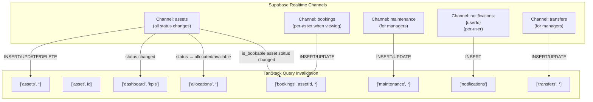
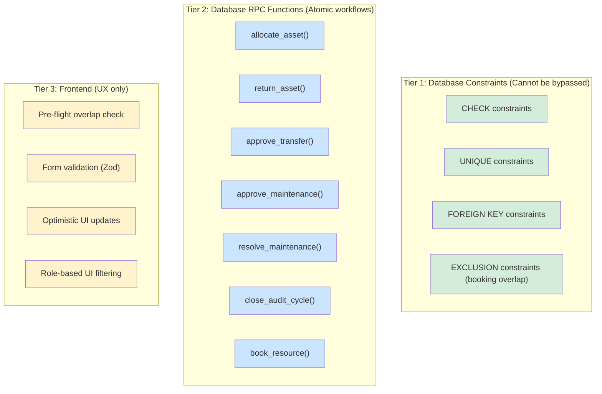

# AssetFlow — v1.1 Architecture Patch

> **Errata and refinements to the [v1.0 Engineering Design Specification](file:///C:/Users/LENOVO/.gemini/antigravity-ide/brain/c2b5ecfe-8403-4fb3-b992-80b98b9bcd2d/implementation_plan.md).**
> This document does not replace v1.0. It specifies exact changes to apply. When v1.0 and v1.1 conflict, **v1.1 wins**.

---

## Table of Contents

1. [Patch 1 — Eliminate Duplicated State (Single Source of Truth)](#patch-1--eliminate-duplicated-state)
2. [Patch 2 — Role Hierarchy & Deadlock Prevention](#patch-2--role-hierarchy--deadlock-prevention)
3. [Patch 3 — Real-Time Synchronization Strategy](#patch-3--real-time-synchronization-strategy)
4. [Patch 4 — Business-Oriented API Contracts](#patch-4--business-oriented-api-contracts)
5. [Patch 5 — Triggers vs. Frontend: Decision Framework](#patch-5--triggers-vs-frontend-decision-framework)
6. [Cross-Cutting Impact Summary](#cross-cutting-impact-summary)

---

## Patch 1 — Eliminate Duplicated State

### The Problem

v1.0 §3.2.4 stores `current_holder_id` and `expected_return_date` on the `assets` table while maintaining a full `allocations` table. This creates a **dual-write vulnerability**: any allocation, transfer, or return must update both tables atomically, and if one write succeeds and the other fails (network error, RLS mismatch, concurrent request), the system enters an inconsistent state where `assets.current_holder_id` disagrees with `allocations WHERE is_active = true`.

### The Decision

**Remove `current_holder_id` and `expected_return_date` from the `assets` table entirely.** The `allocations` table is the single source of truth for "who holds what." The frontend gets the same enriched shape via a view.

### Schema Changes

#### 1.1 — Modified `assets` table (replaces v1.0 §3.2.4)

```diff
 CREATE TABLE assets (
   id                UUID PRIMARY KEY DEFAULT gen_random_uuid(),
   asset_tag         TEXT NOT NULL UNIQUE,
   name              TEXT NOT NULL,
   category_id       UUID NOT NULL REFERENCES asset_categories(id) ON DELETE RESTRICT,
   serial_number     TEXT,
   acquisition_date  DATE,
   acquisition_cost  NUMERIC(12,2),
   condition         TEXT DEFAULT 'new',
   location          TEXT,
   status            asset_status NOT NULL DEFAULT 'available',
   is_bookable       BOOLEAN NOT NULL DEFAULT false,
   department_id     UUID REFERENCES departments(id) ON DELETE SET NULL,
   photo_url         TEXT,
   documents         JSONB DEFAULT '[]'::jsonb,
   custom_field_values JSONB DEFAULT '{}'::jsonb,
-  current_holder_id UUID REFERENCES profiles(id) ON DELETE SET NULL,
-  expected_return_date DATE,
   registered_by     UUID NOT NULL REFERENCES profiles(id),
   created_at        TIMESTAMPTZ NOT NULL DEFAULT now(),
   updated_at        TIMESTAMPTZ NOT NULL DEFAULT now()
 );
```

Remove `idx_assets_holder` from the index list.

#### 1.2 — New materialized view: `asset_current_allocation`

This materialized view pre-computes the "current holder" join, giving us O(1) lookup without duplicated columns:

```sql
CREATE MATERIALIZED VIEW asset_current_allocation AS
SELECT
  a.asset_id,
  a.allocated_to    AS current_holder_id,
  a.expected_return  AS expected_return_date,
  a.allocated_at,
  a.department_id    AS allocation_department_id
FROM allocations a
WHERE a.is_active = true;

-- Unique index required for REFRESH MATERIALIZED VIEW CONCURRENTLY
CREATE UNIQUE INDEX idx_aca_asset ON asset_current_allocation(asset_id);
CREATE INDEX idx_aca_holder ON asset_current_allocation(current_holder_id);
```

**Why materialized view instead of a regular view?** Performance. A regular view would execute a filtered `allocations` scan on every `assets` query. The materialized view pre-computes it. At hackathon scale (hundreds to low thousands of assets), both perform well, but the materialized view sets us up for the "next 10 years" scalability mandate.

**Refresh strategy:** Triggered automatically on allocation state changes:

```sql
CREATE OR REPLACE FUNCTION refresh_asset_current_allocation()
RETURNS TRIGGER AS $$
BEGIN
  REFRESH MATERIALIZED VIEW CONCURRENTLY asset_current_allocation;
  RETURN NULL;
END;
$$ LANGUAGE plpgsql SECURITY DEFINER;

CREATE TRIGGER trg_refresh_aca
  AFTER INSERT OR UPDATE OR DELETE ON allocations
  FOR EACH STATEMENT
  EXECUTE FUNCTION refresh_asset_current_allocation();
```

> [!NOTE]
> `REFRESH MATERIALIZED VIEW CONCURRENTLY` does not lock reads during refresh. This is safe for concurrent access. At extreme scale (millions of allocations), replace with a trigger that maintains a lightweight `current_allocations` table instead.

#### 1.3 — New composite view: `assets_enriched`

This is the **primary query surface** for all frontend asset reads. It replaces all direct `from('assets').select(...)` calls.

```sql
CREATE VIEW assets_enriched AS
SELECT
  a.*,
  c.name         AS category_name,
  c.custom_fields AS category_custom_fields,
  d.name         AS department_name,
  aca.current_holder_id,
  aca.expected_return_date,
  aca.allocated_at AS current_allocation_date,
  holder.full_name AS current_holder_name,
  holder.email     AS current_holder_email
FROM assets a
LEFT JOIN asset_categories c ON c.id = a.category_id
LEFT JOIN departments d ON d.id = a.department_id
LEFT JOIN asset_current_allocation aca ON aca.asset_id = a.id
LEFT JOIN profiles holder ON holder.id = aca.current_holder_id;
```

#### 1.4 — Frontend query migration

All existing `assetsService` calls change to query the view:

```diff
 // src/services/assets.service.js
 async list(filters) {
-  return supabase.from('assets').select('*, category:asset_categories(name), holder:profiles!current_holder_id(full_name)');
+  return supabase.from('assets_enriched').select('*');
 }

 async getById(id) {
-  return supabase.from('assets').select('*, category:asset_categories(*), holder:profiles!current_holder_id(*)').eq('id', id).single();
+  return supabase.from('assets_enriched').select('*').eq('id', id).single();
 }
```

**The frontend shape is identical.** Columns `current_holder_id`, `expected_return_date`, `current_holder_name` are still present — they just come from the view join instead of denormalized columns. No page component changes are required.

#### 1.5 — Updated dashboard_kpis view (replaces v1.0 §3.4)

```sql
CREATE VIEW dashboard_kpis AS
SELECT
  COUNT(*) FILTER (WHERE status = 'available') AS assets_available,
  COUNT(*) FILTER (WHERE status = 'allocated') AS assets_allocated,
  (SELECT COUNT(*) FROM maintenance_requests
   WHERE status IN ('approved','technician_assigned','in_progress')
   AND DATE(created_at) = CURRENT_DATE) AS maintenance_today,
  (SELECT COUNT(*) FROM bookings
   WHERE status IN ('upcoming','ongoing')) AS active_bookings,
  (SELECT COUNT(*) FROM transfer_requests
   WHERE status = 'requested') AS pending_transfers,
  (SELECT COUNT(*) FROM allocations
   WHERE is_active = true AND expected_return IS NOT NULL
   AND expected_return < CURRENT_DATE) AS overdue_returns
FROM assets;
```

> This is unchanged from v1.0 — it already reads overdue data from `allocations`, not `assets`. Listed here to confirm no regression.

#### 1.6 — Updated ERD (replaces v1.0 §3.3)

```diff
-    assets }o--o| profiles : "current_holder"
```

Remove the `assets → profiles` "current_holder" relationship. The link now exists only through `allocations → profiles`.

---

## Patch 2 — Role Hierarchy & Deadlock Prevention

### The Problem

v1.0 §2.2 defines Admin as a purely administrative role with **no Asset Manager capabilities**. If an organization has zero users with the `asset_manager` role, no one can register assets, approve transfers, approve maintenance, or manage audit discrepancies. The system deadlocks.

The PDF problem statement assigns the Admin role as *"Manages departments, asset categories, audit cycles, and employee/role assignment"* and *"Views organization-wide analytics"*. It does **not** say Admin is excluded from operational functions — it simply lists Admin's unique capabilities. The architectural interpretation that Admin cannot do what Asset Managers do was an incorrect constraint.

### The Decision

**Admin inherits all Asset Manager permissions.** The role hierarchy is strict and total:

```
admin > asset_manager > department_head > employee
```

Every permission check — both in RLS and in frontend `permissions.js` — uses a hierarchy-aware function instead of flat role comparisons.

### 2.1 — New hierarchy-aware SQL helper (replaces v1.0 §4.2)

```sql
-- Maps roles to a numeric privilege level
CREATE OR REPLACE FUNCTION role_level(r user_role)
RETURNS INT AS $$
  SELECT CASE r
    WHEN 'admin'           THEN 40
    WHEN 'asset_manager'   THEN 30
    WHEN 'department_head' THEN 20
    WHEN 'employee'        THEN 10
  END;
$$ LANGUAGE sql IMMUTABLE;

-- "Does the current user have at least this role's privileges?"
CREATE OR REPLACE FUNCTION has_role_privilege(required_role user_role)
RETURNS BOOLEAN AS $$
  SELECT role_level(get_user_role()) >= role_level(required_role);
$$ LANGUAGE sql SECURITY DEFINER STABLE;
```

### 2.2 — Updated permission matrix (replaces v1.0 §2.2)

| Action | Employee | Dept Head | Asset Manager | Admin |
|---|---|---|---|---|
| View own allocated assets | ✅ | ✅ | ✅ | ✅ |
| View department assets | ❌ | ✅ (own dept) | ✅ (all) | ✅ (all) |
| Register asset | ❌ | ❌ | ✅ | ✅ ← **changed** |
| Allocate asset | ❌ | ❌ | ✅ | ✅ ← **changed** |
| Approve transfer (own dept) | ❌ | ✅ | ✅ | ✅ ← **changed** |
| Approve transfer (cross-dept) | ❌ | ❌ | ✅ | ✅ ← **changed** |
| Initiate transfer/return request | ✅ | ✅ | ✅ | ✅ ← **changed** |
| Book shared resource | ✅ | ✅ | ✅ | ✅ ← **changed** |
| Raise maintenance request | ✅ | ✅ | ✅ | ✅ ← **changed** |
| Approve maintenance | ❌ | ❌ | ✅ | ✅ ← **changed** |
| Manage departments/categories | ❌ | ❌ | ❌ | ✅ |
| Promote/demote roles | ❌ | ❌ | ❌ | ✅ |
| Create audit cycle | ❌ | ❌ | ❌ | ✅ |
| Act as auditor | ✅ | ✅ | ✅ | ✅ |
| View org-wide analytics | ❌ | ❌ | ✅ | ✅ |
| View activity logs | Own only | Dept | All | All |

> [!IMPORTANT]
> The Admin column is now **fully green for every operational action**. This is correct: the Admin is the root user. If you're the only person in the system, you can do everything.

### 2.3 — Updated RLS policies (replaces all of v1.0 §4.3)

Every policy that previously checked `get_user_role() = 'asset_manager'` or `get_user_role() IN ('asset_manager', 'admin')` now uses `has_role_privilege('asset_manager')`. This single change propagates the hierarchy.

**Full policy rewrites:**

#### `assets`

| Policy | Operation | v1.0 Rule | **v1.1 Rule** |
|---|---|---|---|
| `assets_insert` | INSERT | `get_user_role() = 'asset_manager'` | `has_role_privilege('asset_manager')` |
| `assets_update` | UPDATE | `get_user_role() IN ('asset_manager', 'admin')` | `has_role_privilege('asset_manager')` |

#### `allocations`

| Policy | Operation | v1.0 Rule | **v1.1 Rule** |
|---|---|---|---|
| `alloc_select_manager` | SELECT | `get_user_role() IN ('asset_manager', 'admin')` | `has_role_privilege('asset_manager')` |
| `alloc_insert` | INSERT | `get_user_role() = 'asset_manager'` | `has_role_privilege('asset_manager')` |
| `alloc_update` | UPDATE | `get_user_role() = 'asset_manager'` | `has_role_privilege('asset_manager')` |

#### `transfer_requests`

| Policy | Operation | v1.0 Rule | **v1.1 Rule** |
|---|---|---|---|
| `transfer_update` | UPDATE | `get_user_role() IN ('asset_manager', 'department_head')` | `has_role_privilege('department_head')` |

#### `bookings`

| Policy | Operation | v1.0 Rule | **v1.1 Rule** |
|---|---|---|---|
| `bookings_insert` | INSERT | Authenticated | Authenticated (unchanged — all roles including Admin can book) |
| `bookings_update_manager` | UPDATE | `get_user_role() IN ('asset_manager', 'admin')` | `has_role_privilege('asset_manager')` |

#### `maintenance_requests`

| Policy | Operation | v1.0 Rule | **v1.1 Rule** |
|---|---|---|---|
| `maint_select_manager` | SELECT | `get_user_role() IN ('asset_manager', 'admin')` | `has_role_privilege('asset_manager')` |
| `maint_insert` | INSERT | Authenticated | Authenticated (unchanged) |
| `maint_update` | UPDATE | `get_user_role() = 'asset_manager'` | `has_role_privilege('asset_manager')` |

#### `audit_cycles`, `audit_assignments`, `audit_items`

No change — these already allow `admin`. But for consistency:

| Policy | Operation | **v1.1 Rule** |
|---|---|---|
| `audit_select` | SELECT | `has_role_privilege('asset_manager')` OR user is assigned auditor |
| `audit_item_update` | UPDATE | User is assigned auditor OR `has_role_privilege('admin')` |

#### `activity_logs`, `notifications`

No change — these already have correct admin access.

### 2.4 — Updated frontend permissions.js (replaces v1.0 §10.1)

```js
// src/lib/permissions.js

const ROLE_LEVELS = {
  employee: 10,
  department_head: 20,
  asset_manager: 30,
  admin: 40,
};

/**
 * Core hierarchy check. "Does this role have at least the privileges of the required role?"
 * admin >= asset_manager >= department_head >= employee
 */
export function hasRolePrivilege(userRole, requiredRole) {
  return (ROLE_LEVELS[userRole] ?? 0) >= (ROLE_LEVELS[requiredRole] ?? Infinity);
}

// All permission functions now delegate to hasRolePrivilege:
export const canRegisterAsset = (role) => hasRolePrivilege(role, 'asset_manager');
export const canAllocateAsset = (role) => hasRolePrivilege(role, 'asset_manager');
export const canApproveMaintenance = (role) => hasRolePrivilege(role, 'asset_manager');
export const canCreateAudit = (role) => hasRolePrivilege(role, 'admin');
export const canManageOrg = (role) => hasRolePrivilege(role, 'admin');
export const canViewAllAnalytics = (role) => hasRolePrivilege(role, 'asset_manager');
export const canBookResource = (role) => hasRolePrivilege(role, 'employee'); // all roles
export const canRaiseMaintenance = (role) => hasRolePrivilege(role, 'employee'); // all roles

export function canApproveTransfer(role, userDeptId, assetDeptId) {
  if (hasRolePrivilege(role, 'asset_manager')) return true; // AM + Admin: global
  if (role === 'department_head' && userDeptId === assetDeptId) return true; // DH: own dept
  return false;
}
```

### 2.5 — Updated RoleGate behavior

```jsx
// RoleGate now uses the hierarchy check
// <RoleGate minRole="asset_manager"> means "asset_manager OR admin"
<RoleGate minRole="asset_manager">{children}</RoleGate>

// Implementation uses hasRolePrivilege internally:
function RoleGate({ minRole, children }) {
  const { role } = useProfile();
  if (!hasRolePrivilege(role, minRole)) return null;
  return children;
}
```

---

## Patch 3 — Real-Time Synchronization Strategy

### The Problem

v1.0 §7.3 defines only 3 Realtime channels (notifications, bookings per asset, maintenance) with no standardized pattern. If Developer B allocates an asset (status → `allocated`), Developer C's Booking page still shows it as available until a manual refetch. The Dashboard KPIs go stale. There is no architectural contract for how Realtime events propagate to TanStack Query.

### The Decision

Define a **5-channel Realtime architecture** with a standardized hook pattern. The `assets` table is the **hub** — any status change on `assets` cascades invalidation to every dependent query.

### 3.1 — Channel Architecture



### 3.2 — Supabase Realtime Configuration (replaces v1.0 §12.1 Realtime row)

Enable Realtime publications for exactly these tables:

```sql
ALTER PUBLICATION supabase_realtime ADD TABLE assets;
ALTER PUBLICATION supabase_realtime ADD TABLE bookings;
ALTER PUBLICATION supabase_realtime ADD TABLE maintenance_requests;
ALTER PUBLICATION supabase_realtime ADD TABLE notifications;
ALTER PUBLICATION supabase_realtime ADD TABLE transfer_requests;
```

> [!WARNING]
> Do **not** enable Realtime on `allocations`, `audit_items`, `activity_logs`, or `profiles`. These are high-write tables where Realtime would create excessive noise. Their data is instead invalidated indirectly when the `assets` channel fires (because allocation changes always accompany asset status changes).

### 3.3 — Standardized Realtime Hook (Developer D owns, all consume)

```js
// src/hooks/useRealtimeInvalidation.js

import { useEffect } from 'react';
import { useQueryClient } from '@tanstack/react-query';
import { supabase } from '../supabase';

/**
 * Subscribe to a Supabase Realtime channel and automatically invalidate
 * the specified TanStack Query keys when events arrive.
 *
 * @param {string} channelName - Unique channel identifier
 * @param {object} subscription - { table, schema?, filter?, event? }
 * @param {string[][]} queryKeysToInvalidate - Array of TanStack Query key prefixes
 * @param {object} options - { enabled?: boolean }
 */
export function useRealtimeInvalidation(
  channelName,
  subscription,
  queryKeysToInvalidate,
  options = {}
) {
  const queryClient = useQueryClient();
  const { enabled = true } = options;

  useEffect(() => {
    if (!enabled) return;

    const channel = supabase
      .channel(channelName)
      .on(
        'postgres_changes',
        {
          event: subscription.event ?? '*',
          schema: subscription.schema ?? 'public',
          table: subscription.table,
          filter: subscription.filter,
        },
        (payload) => {
          // Invalidate all specified query key prefixes
          queryKeysToInvalidate.forEach((keyPrefix) => {
            queryClient.invalidateQueries({ queryKey: keyPrefix });
          });
        }
      )
      .subscribe();

    return () => {
      supabase.removeChannel(channel);
    };
  }, [channelName, enabled]);
}
```

### 3.4 — Channel Usage Per Page

#### Global (mounted in `AppShell`, always active):

```js
// Always listening — fires for any asset status change
useRealtimeInvalidation(
  'global:assets',
  { table: 'assets', event: 'UPDATE' },
  [['assets'], ['dashboard', 'kpis'], ['allocations']]
);

// Per-user notifications
useRealtimeInvalidation(
  `notifications:${userId}`,
  { table: 'notifications', filter: `user_id=eq.${userId}`, event: 'INSERT' },
  [['notifications']],
);
// Additionally: increment notificationStore.unreadCount via the payload callback
```

#### DashboardPage (Screen 2):

```js
// Already covered by global:assets channel
// KPIs auto-invalidated when any asset status changes
```

#### BookingsPage (Screen 6):

```js
// When viewing a specific asset's calendar
useRealtimeInvalidation(
  `bookings:${selectedAssetId}`,
  { table: 'bookings', filter: `asset_id=eq.${selectedAssetId}` },
  [['bookings', selectedAssetId]],
  { enabled: !!selectedAssetId }
);
```

#### MaintenancePage (Screen 7):

```js
useRealtimeInvalidation(
  'maintenance:all',
  { table: 'maintenance_requests' },
  [['maintenance']],
  { enabled: hasRolePrivilege(role, 'asset_manager') }
);
```

#### AllocationPage (Screen 5):

```js
// Transfer requests channel
useRealtimeInvalidation(
  'transfers:all',
  { table: 'transfer_requests' },
  [['transfers']],
  { enabled: hasRolePrivilege(role, 'department_head') }
);
// Asset allocation changes are covered by the global:assets channel
```

### 3.5 — Notification Toast Integration

For notifications specifically, the global subscription also triggers a toast:

```js
// In AppShell.jsx, alongside the invalidation hook:
useEffect(() => {
  const channel = supabase
    .channel(`notif-toast:${userId}`)
    .on('postgres_changes', {
      event: 'INSERT',
      schema: 'public',
      table: 'notifications',
      filter: `user_id=eq.${userId}`,
    }, (payload) => {
      const notif = payload.new;
      toast(notif.title, { description: notif.message });
      useNotificationStore.getState().incrementUnread();
    })
    .subscribe();

  return () => supabase.removeChannel(channel);
}, [userId]);
```

### 3.6 — Race Condition Handling

When a user tries to book a resource that was just booked by someone else:

1. The Realtime channel fires → `['bookings', assetId]` invalidated → calendar re-renders showing the new booking.
2. If the user already submitted their form, the **DB exclusion constraint** rejects the insert with a Postgres error.
3. The service layer catches this specific error and returns a user-friendly message:

```js
// In bookings.service.js → bookResource()
const { error } = await supabase.from('bookings').insert(data);
if (error?.code === '23P01') { // exclusion_violation
  throw new BookingConflictError('This time slot was just booked by someone else. Please choose another.');
}
```

---

## Patch 4 — Business-Oriented API Contracts

### The Problem

v1.0 services are structured as thin CRUD wrappers (`insert`, `update`, `select`) that leak database implementation into the UI. For example, `allocationsService.allocate()` needs to:
1. Insert into `allocations`
2. Update `assets.status` to `allocated`
3. Insert into `activity_logs`
4. Insert into `notifications`

If the frontend orchestrates these as 4 separate Supabase REST calls, any failure mid-sequence leaves the database inconsistent. The UI developer is also forced to understand the database schema, violating the separation of concerns.

### The Decision

**Move all multi-step business operations into Postgres RPC functions.** The frontend service layer becomes a thin caller that invokes named operations. Each RPC function runs inside a single transaction — it either fully commits or fully rolls back.

> [!IMPORTANT]
> This is not a philosophical preference. Supabase's REST API (PostgREST) does **not** support client-side transactions. If you make two separate `.insert()` / `.update()` calls from the frontend, they execute as two independent transactions. The only way to get atomicity is server-side: either RPC functions or Edge Functions. We choose RPC functions because they stay within PostgreSQL, require no additional deployment, and are covered by RLS.

### 4.1 — RPC Function Catalog (Developer A implements all)

#### `allocate_asset`

```sql
CREATE OR REPLACE FUNCTION allocate_asset(
  p_asset_id UUID,
  p_to_user_id UUID,
  p_expected_return DATE DEFAULT NULL,
  p_notes TEXT DEFAULT NULL
) RETURNS UUID AS $$
DECLARE
  v_allocation_id UUID;
  v_asset_status asset_status;
  v_holder_name TEXT;
BEGIN
  -- Lock the asset row to prevent concurrent allocation
  SELECT status INTO v_asset_status FROM assets WHERE id = p_asset_id FOR UPDATE;

  IF v_asset_status IS NULL THEN
    RAISE EXCEPTION 'Asset not found' USING ERRCODE = 'P0002';
  END IF;

  IF v_asset_status != 'available' THEN
    SELECT full_name INTO v_holder_name
    FROM profiles p
    JOIN allocations a ON a.allocated_to = p.id
    WHERE a.asset_id = p_asset_id AND a.is_active = true
    LIMIT 1;

    RAISE EXCEPTION 'Asset is currently % — held by %', v_asset_status, COALESCE(v_holder_name, 'unknown')
      USING ERRCODE = 'P0001';
  END IF;

  -- Create allocation
  INSERT INTO allocations (asset_id, allocated_to, allocated_by, department_id, expected_return)
  VALUES (
    p_asset_id,
    p_to_user_id,
    auth.uid(),
    (SELECT department_id FROM profiles WHERE id = p_to_user_id),
    p_expected_return
  ) RETURNING id INTO v_allocation_id;

  -- Update asset status
  UPDATE assets SET status = 'allocated', updated_at = now() WHERE id = p_asset_id;

  -- Log activity
  INSERT INTO activity_logs (actor_id, action, entity_type, entity_id, metadata)
  VALUES (auth.uid(), 'asset.allocated', 'allocation', v_allocation_id,
    jsonb_build_object('asset_id', p_asset_id, 'to_user_id', p_to_user_id));

  -- Notify the recipient
  PERFORM create_notification(
    p_to_user_id, 'asset_assigned', 'Asset Assigned',
    'You have been allocated asset ' || (SELECT asset_tag FROM assets WHERE id = p_asset_id),
    p_asset_id, 'asset'
  );

  RETURN v_allocation_id;
END;
$$ LANGUAGE plpgsql SECURITY DEFINER;
```

#### `return_asset`

```sql
CREATE OR REPLACE FUNCTION return_asset(
  p_allocation_id UUID,
  p_return_condition TEXT,
  p_return_notes TEXT DEFAULT NULL
) RETURNS VOID AS $$
DECLARE
  v_asset_id UUID;
BEGIN
  -- Get and validate
  SELECT asset_id INTO v_asset_id
  FROM allocations WHERE id = p_allocation_id AND is_active = true;

  IF v_asset_id IS NULL THEN
    RAISE EXCEPTION 'Active allocation not found' USING ERRCODE = 'P0002';
  END IF;

  -- Close allocation
  UPDATE allocations SET
    is_active = false,
    returned_at = now(),
    return_condition = p_return_condition,
    return_notes = p_return_notes
  WHERE id = p_allocation_id;

  -- Revert asset status
  UPDATE assets SET status = 'available', condition = p_return_condition, updated_at = now()
  WHERE id = v_asset_id;

  -- Log
  INSERT INTO activity_logs (actor_id, action, entity_type, entity_id, metadata)
  VALUES (auth.uid(), 'asset.returned', 'allocation', p_allocation_id,
    jsonb_build_object('asset_id', v_asset_id, 'condition', p_return_condition));
END;
$$ LANGUAGE plpgsql SECURITY DEFINER;
```

#### `approve_transfer`

```sql
CREATE OR REPLACE FUNCTION approve_transfer(
  p_transfer_id UUID
) RETURNS VOID AS $$
DECLARE
  v_asset_id UUID;
  v_from_id UUID;
  v_to_id UUID;
  v_old_allocation_id UUID;
BEGIN
  SELECT asset_id, from_holder_id, to_holder_id INTO v_asset_id, v_from_id, v_to_id
  FROM transfer_requests WHERE id = p_transfer_id AND status = 'requested';

  IF v_asset_id IS NULL THEN
    RAISE EXCEPTION 'Transfer request not found or not in requested state' USING ERRCODE = 'P0002';
  END IF;

  -- Approve the transfer
  UPDATE transfer_requests SET
    status = 'approved',
    approved_by = auth.uid(),
    approved_at = now(),
    updated_at = now()
  WHERE id = p_transfer_id;

  -- Close old allocation
  SELECT id INTO v_old_allocation_id
  FROM allocations WHERE asset_id = v_asset_id AND is_active = true;

  IF v_old_allocation_id IS NOT NULL THEN
    UPDATE allocations SET is_active = false, returned_at = now()
    WHERE id = v_old_allocation_id;
  END IF;

  -- Create new allocation
  INSERT INTO allocations (asset_id, allocated_to, allocated_by, department_id)
  VALUES (
    v_asset_id,
    v_to_id,
    auth.uid(),
    (SELECT department_id FROM profiles WHERE id = v_to_id)
  );

  -- Mark transfer completed
  UPDATE transfer_requests SET status = 'completed', completed_at = now(), updated_at = now()
  WHERE id = p_transfer_id;

  -- Log + notify
  INSERT INTO activity_logs (actor_id, action, entity_type, entity_id, metadata)
  VALUES (auth.uid(), 'transfer.approved', 'transfer', p_transfer_id,
    jsonb_build_object('asset_id', v_asset_id, 'from', v_from_id, 'to', v_to_id));

  PERFORM create_notification(v_to_id, 'transfer_approved', 'Transfer Approved',
    'A transfer has been approved for asset ' || (SELECT asset_tag FROM assets WHERE id = v_asset_id),
    v_asset_id, 'asset');
END;
$$ LANGUAGE plpgsql SECURITY DEFINER;
```

#### `book_resource`

```sql
CREATE OR REPLACE FUNCTION book_resource(
  p_asset_id UUID,
  p_start_time TIMESTAMPTZ,
  p_end_time TIMESTAMPTZ,
  p_notes TEXT DEFAULT NULL
) RETURNS UUID AS $$
DECLARE
  v_booking_id UUID;
  v_is_bookable BOOLEAN;
BEGIN
  -- Validate the asset is bookable
  SELECT is_bookable INTO v_is_bookable FROM assets WHERE id = p_asset_id;
  IF NOT v_is_bookable THEN
    RAISE EXCEPTION 'Asset is not a bookable resource' USING ERRCODE = 'P0001';
  END IF;

  -- The exclusion constraint handles overlap — we just insert and let PG enforce it
  INSERT INTO bookings (asset_id, booked_by, start_time, end_time, notes)
  VALUES (p_asset_id, auth.uid(), p_start_time, p_end_time, p_notes)
  RETURNING id INTO v_booking_id;

  -- Log
  INSERT INTO activity_logs (actor_id, action, entity_type, entity_id, metadata)
  VALUES (auth.uid(), 'booking.created', 'booking', v_booking_id,
    jsonb_build_object('asset_id', p_asset_id, 'start', p_start_time, 'end', p_end_time));

  -- Notify
  PERFORM create_notification(auth.uid(), 'booking_confirmed', 'Booking Confirmed',
    format('Your booking for %s on %s is confirmed',
      (SELECT name FROM assets WHERE id = p_asset_id),
      to_char(p_start_time, 'Mon DD, HH24:MI')),
    v_booking_id, 'booking');

  RETURN v_booking_id;
END;
$$ LANGUAGE plpgsql SECURITY DEFINER;
```

#### `approve_maintenance`

```sql
CREATE OR REPLACE FUNCTION approve_maintenance(
  p_request_id UUID
) RETURNS VOID AS $$
DECLARE
  v_asset_id UUID;
  v_requester_id UUID;
BEGIN
  SELECT asset_id, requested_by INTO v_asset_id, v_requester_id
  FROM maintenance_requests WHERE id = p_request_id AND status = 'pending';

  IF v_asset_id IS NULL THEN
    RAISE EXCEPTION 'Maintenance request not found or not pending' USING ERRCODE = 'P0002';
  END IF;

  UPDATE maintenance_requests SET
    status = 'approved',
    approved_by = auth.uid(),
    approved_at = now(),
    updated_at = now()
  WHERE id = p_request_id;

  -- Asset status flip (replaces the v1.0 trigger — now inside the RPC)
  UPDATE assets SET status = 'under_maintenance', updated_at = now() WHERE id = v_asset_id;

  INSERT INTO activity_logs (actor_id, action, entity_type, entity_id, metadata)
  VALUES (auth.uid(), 'maintenance.approved', 'maintenance', p_request_id,
    jsonb_build_object('asset_id', v_asset_id));

  PERFORM create_notification(v_requester_id, 'maintenance_approved', 'Maintenance Approved',
    'Your maintenance request has been approved',
    p_request_id, 'maintenance');
END;
$$ LANGUAGE plpgsql SECURITY DEFINER;
```

#### `resolve_maintenance`

```sql
CREATE OR REPLACE FUNCTION resolve_maintenance(
  p_request_id UUID,
  p_resolution_notes TEXT
) RETURNS VOID AS $$
DECLARE
  v_asset_id UUID;
  v_requester_id UUID;
BEGIN
  SELECT asset_id, requested_by INTO v_asset_id, v_requester_id
  FROM maintenance_requests WHERE id = p_request_id AND status IN ('in_progress', 'technician_assigned');

  IF v_asset_id IS NULL THEN
    RAISE EXCEPTION 'Request not found or not in a resolvable state' USING ERRCODE = 'P0002';
  END IF;

  UPDATE maintenance_requests SET
    status = 'resolved',
    resolution_notes = p_resolution_notes,
    resolved_at = now(),
    updated_at = now()
  WHERE id = p_request_id;

  UPDATE assets SET status = 'available', updated_at = now() WHERE id = v_asset_id;

  INSERT INTO activity_logs (actor_id, action, entity_type, entity_id, metadata)
  VALUES (auth.uid(), 'maintenance.resolved', 'maintenance', p_request_id,
    jsonb_build_object('asset_id', v_asset_id, 'notes', p_resolution_notes));
END;
$$ LANGUAGE plpgsql SECURITY DEFINER;
```

#### `close_audit_cycle`

```sql
CREATE OR REPLACE FUNCTION close_audit_cycle(
  p_cycle_id UUID
) RETURNS TABLE(discrepancy_count BIGINT) AS $$
DECLARE
  v_count BIGINT;
BEGIN
  -- Verify the cycle is open/in_progress
  IF NOT EXISTS (SELECT 1 FROM audit_cycles WHERE id = p_cycle_id AND status != 'closed') THEN
    RAISE EXCEPTION 'Audit cycle not found or already closed' USING ERRCODE = 'P0002';
  END IF;

  -- Mark missing assets as lost
  UPDATE assets SET status = 'lost', updated_at = now()
  WHERE id IN (
    SELECT asset_id FROM audit_items
    WHERE audit_cycle_id = p_cycle_id AND status = 'missing'
  );

  -- Close the cycle
  UPDATE audit_cycles SET status = 'closed', closed_at = now(), updated_at = now()
  WHERE id = p_cycle_id;

  -- Count discrepancies
  SELECT COUNT(*) INTO v_count
  FROM audit_items
  WHERE audit_cycle_id = p_cycle_id AND status != 'verified';

  -- Log
  INSERT INTO activity_logs (actor_id, action, entity_type, entity_id, metadata)
  VALUES (auth.uid(), 'audit.closed', 'audit', p_cycle_id,
    jsonb_build_object('discrepancies', v_count));

  -- Notify admins/managers about discrepancies
  IF v_count > 0 THEN
    INSERT INTO notifications (user_id, type, title, message, reference_id, reference_type)
    SELECT p.id, 'audit_discrepancy_flagged', 'Audit Discrepancies Found',
      format('%s discrepancies found in audit cycle', v_count),
      p_cycle_id, 'audit'
    FROM profiles p WHERE p.role IN ('admin', 'asset_manager');
  END IF;

  RETURN QUERY SELECT v_count;
END;
$$ LANGUAGE plpgsql SECURITY DEFINER;
```

### 4.2 — Redesigned Frontend Service Layer

Services now call `supabase.rpc()` for all workflow operations. Simple reads remain as direct `.from().select()` calls.

**Pattern:**

```js
// READS: Direct Supabase REST (query builder)
async list(filters) { return supabase.from('assets_enriched').select('*'); }

// WRITES: RPC calls (atomic workflows)
async allocate(assetId, toUserId, expectedReturn) {
  return supabase.rpc('allocate_asset', {
    p_asset_id: assetId,
    p_to_user_id: toUserId,
    p_expected_return: expectedReturn,
  });
}
```

**Updated service contracts by developer:**

#### Developer B — `allocations.service.js` (replaces v1.0 §10.2)

```js
export const allocationsService = {
  // READS — unchanged, direct queries
  async getHistory(assetId) {
    return supabase.from('allocations')
      .select('*, holder:profiles!allocated_to(full_name)')
      .eq('asset_id', assetId)
      .order('allocated_at', { ascending: false });
  },
  async getActive(filters) {
    return supabase.from('allocations')
      .select('*, asset:assets(asset_tag, name), holder:profiles!allocated_to(full_name)')
      .eq('is_active', true);
  },
  async getOverdue() {
    return supabase.from('overdue_allocations').select('*');
  },

  // WRITES — atomic RPC calls
  async allocateAsset(assetId, toUserId, expectedReturn) {
    return supabase.rpc('allocate_asset', {
      p_asset_id: assetId,
      p_to_user_id: toUserId,
      p_expected_return: expectedReturn,
    });
  },
  async returnAsset(allocationId, condition, notes) {
    return supabase.rpc('return_asset', {
      p_allocation_id: allocationId,
      p_return_condition: condition,
      p_return_notes: notes,
    });
  },
};
```

#### Developer B — `transfers.service.js`

```js
export const transfersService = {
  // READS
  async getPending() {
    return supabase.from('transfer_requests')
      .select('*, asset:assets(asset_tag, name), from:profiles!from_holder_id(full_name), to:profiles!to_holder_id(full_name)')
      .eq('status', 'requested');
  },

  // WRITES
  async requestTransfer(assetId, fromId, toId, reason) {
    // Simple insert — no multi-step logic, so direct insert is fine
    return supabase.from('transfer_requests').insert({
      asset_id: assetId,
      from_holder_id: fromId,
      to_holder_id: toId,
      requested_by: (await supabase.auth.getUser()).data.user.id,
      reason,
    });
  },
  async approveTransfer(transferId) {
    return supabase.rpc('approve_transfer', { p_transfer_id: transferId });
  },
  async rejectTransfer(transferId) {
    return supabase.from('transfer_requests')
      .update({ status: 'rejected', approved_by: (await supabase.auth.getUser()).data.user.id, updated_at: new Date().toISOString() })
      .eq('id', transferId);
  },
};
```

#### Developer C — `bookings.service.js`

```js
export const bookingsService = {
  // READS
  async listForAsset(assetId, dateRange) {
    return supabase.from('bookings')
      .select('*, booker:profiles!booked_by(full_name)')
      .eq('asset_id', assetId)
      .gte('start_time', dateRange.start)
      .lte('end_time', dateRange.end)
      .order('start_time');
  },
  async getMyBookings() {
    const userId = (await supabase.auth.getUser()).data.user.id;
    return supabase.from('bookings')
      .select('*, asset:assets(name, asset_tag)')
      .eq('booked_by', userId)
      .order('start_time', { ascending: false });
  },
  async getBookableAssets() {
    return supabase.from('assets_enriched')
      .select('id, name, asset_tag, location')
      .eq('is_bookable', true);
  },

  // WRITES
  async bookResource(assetId, startTime, endTime, notes) {
    return supabase.rpc('book_resource', {
      p_asset_id: assetId,
      p_start_time: startTime,
      p_end_time: endTime,
      p_notes: notes,
    });
  },
  async cancelBooking(bookingId) {
    return supabase.from('bookings')
      .update({ status: 'cancelled', cancelled_at: new Date().toISOString(), updated_at: new Date().toISOString() })
      .eq('id', bookingId);
  },
};
```

#### Developer C — `maintenance.service.js`

```js
export const maintenanceService = {
  // READS
  async list(filters) {
    return supabase.from('maintenance_requests')
      .select('*, asset:assets(name, asset_tag), requester:profiles!requested_by(full_name), technician:profiles!technician_id(full_name)')
      .order('created_at', { ascending: false });
  },
  async getHistoryForAsset(assetId) {
    return supabase.from('maintenance_requests')
      .select('*')
      .eq('asset_id', assetId)
      .order('created_at', { ascending: false });
  },

  // WRITES
  async raiseRequest(assetId, description, priority, photoUrl) {
    // Simple insert — single table, no cascading logic
    return supabase.from('maintenance_requests').insert({
      asset_id: assetId,
      requested_by: (await supabase.auth.getUser()).data.user.id,
      description,
      priority,
      photo_url: photoUrl,
    });
  },
  async approveMaintenance(requestId) {
    return supabase.rpc('approve_maintenance', { p_request_id: requestId });
  },
  async rejectMaintenance(requestId) {
    return supabase.from('maintenance_requests')
      .update({ status: 'rejected', approved_by: (await supabase.auth.getUser()).data.user.id, updated_at: new Date().toISOString() })
      .eq('id', requestId);
  },
  async assignTechnician(requestId, technicianId) {
    return supabase.from('maintenance_requests')
      .update({ status: 'technician_assigned', technician_id: technicianId, assigned_at: new Date().toISOString(), updated_at: new Date().toISOString() })
      .eq('id', requestId);
  },
  async markInProgress(requestId) {
    return supabase.from('maintenance_requests')
      .update({ status: 'in_progress', started_at: new Date().toISOString(), updated_at: new Date().toISOString() })
      .eq('id', requestId);
  },
  async resolveMaintenance(requestId, resolutionNotes) {
    return supabase.rpc('resolve_maintenance', {
      p_request_id: requestId,
      p_resolution_notes: resolutionNotes,
    });
  },
};
```

#### Developer D — `audits.service.js`

```js
export const auditsService = {
  // READS — unchanged
  async listCycles() { /* ... */ },
  async getCycle(cycleId) { /* ... */ },
  async getDiscrepancyReport(cycleId) { /* ... */ },

  // WRITES
  async createCycle(name, scopeType, scopeValue, startDate, endDate, auditorIds) {
    // This remains a multi-step frontend call because it's a creation workflow
    // (not a state transition with invariants). Wrapped in a single RPC if desired,
    // but the individual inserts are idempotent and safe.
    return supabase.rpc('create_audit_cycle', {
      p_name: name, p_scope_type: scopeType, p_scope_value: scopeValue,
      p_start_date: startDate, p_end_date: endDate, p_auditor_ids: auditorIds,
    });
  },
  async updateItem(itemId, status, notes) {
    return supabase.from('audit_items')
      .update({ status, notes, verified_at: new Date().toISOString(), auditor_id: (await supabase.auth.getUser()).data.user.id })
      .eq('id', itemId);
  },
  async closeCycle(cycleId) {
    return supabase.rpc('close_audit_cycle', { p_cycle_id: cycleId });
  },
};
```

### 4.3 — Decision Rule: When to Use RPC vs. Direct Query

| Criteria | Use `supabase.rpc()` | Use `.from().insert/update()` |
|---|---|---|
| Touches multiple tables? | ✅ | ❌ |
| Has data invariants to enforce? | ✅ | ❌ |
| Requires row locking? | ✅ | ❌ |
| Simple single-table write? | ❌ | ✅ |
| Needs activity_log + notification? | ✅ | ❌ |
| Read query? | ❌ | ✅ (always direct) |

---

## Patch 5 — Triggers vs. Frontend: Decision Framework

### The Problem

Reviewers suggested moving workflow logic out of database triggers into the frontend for "easier maintenance." This is a valid concern — triggers are invisible, hard to debug, and create implicit control flow. But moving safety-critical invariants to the frontend is architecturally unsound because the frontend runs on untrusted client hardware and can be bypassed.

### The Decision

**Split concerns into three tiers:**



### 5.1 — What STAYS in the Database (Non-negotiable)

| Mechanism | Enforced Rule | Rationale |
|---|---|---|
| `EXCLUSION USING gist` on `bookings` | No overlapping bookings | **Cannot be enforced from frontend.** Two concurrent requests could both pass a frontend check and race to insert. The DB constraint is the only serializable guard. |
| `CHECK (end_time > start_time)` on `bookings` | End must be after start | Simple data integrity — no reason to trust the client. |
| `CHECK (end_date >= start_date)` on `audit_cycles` | Valid date range | Same. |
| `UNIQUE(audit_cycle_id, asset_id)` on `audit_items` | No duplicate audit items | Prevents double-counting in discrepancy reports. |
| `UNIQUE(audit_cycle_id, auditor_id)` on `audit_assignments` | No duplicate auditor assignments | Data integrity. |
| `generate_asset_tag()` trigger on `assets` | Auto-increment AF-XXXX tags | Must be sequential and gap-free; only the DB can guarantee this under concurrency. |
| `handle_new_user()` trigger on `auth.users` | Profile auto-creation on signup | Runs in `auth` schema — frontend cannot intercept the signup event reliably. |

### 5.2 — What MOVES from Triggers into RPC Functions

| v1.0 Trigger | Why It Moves | v1.1 Location |
|---|---|---|
| `trg_maintenance_status` (asset status flip on approval/resolution) | This was a trigger on `UPDATE OF status ON maintenance_requests`. The problem: it fires on **any** status update, including edge cases where someone manually fixes a status in the Supabase dashboard. Moving it into `approve_maintenance()` and `resolve_maintenance()` RPCs makes the causality explicit. | `approve_maintenance()` and `resolve_maintenance()` RPC functions (see §4.1) |
| `trg_audit_cycle_close` (mark missing assets as lost) | Same issue — a trigger on `UPDATE OF status ON audit_cycles` fires even on non-close status changes. Moving it into `close_audit_cycle()` RPC is clearer. | `close_audit_cycle()` RPC function (see §4.1) |
| Notification creation triggers | v1.0 proposed triggers on every workflow table. This creates an explosion of triggers that are hard to trace. Since all writes now go through RPC functions, the notification insert happens inside the same RPC transaction — explicit and auditable. | Inside each relevant RPC function |
| Activity log creation | Same as notifications — logging happens inside the RPC, not via a separate trigger. | Inside each relevant RPC function |

### 5.3 — What the FRONTEND Does (and Does NOT Do)

> [!CAUTION]
> **The frontend NEVER directly orchestrates multi-table writes.** It calls a single RPC or performs a single-table write. Period.

| Frontend Responsibility | Description |
|---|---|
| **Form validation** | Zod schemas validate input shape before calling the service. Catches typos, missing fields, invalid formats. |
| **Pre-flight checks** (UX) | Before booking, query existing bookings to show conflicts in the UI. This is a UX optimization — the DB constraint is the real guard. |
| **Optimistic updates** | For low-risk actions (mark notification read, cancel own booking), update the UI immediately and roll back on error. |
| **Role-based UI filtering** | Hide buttons/pages the user can't access. This is a convenience — RLS is the actual guard. |
| **Error handling** | Catch specific RPC error codes and translate them to user-friendly messages. |

### 5.4 — Complete Operation Classification Table

| Operation | Tier 1 (DB Constraint) | Tier 2 (RPC Function) | Tier 3 (Frontend) |
|---|---|---|---|
| Prevent booking overlap | `EXCLUSION USING gist` ✅ | — | Pre-flight check (UX) |
| Generate asset tag | `trg_asset_tag` ✅ | — | — |
| Create profile on signup | `on_auth_user_created` ✅ | — | — |
| Allocate asset | — | `allocate_asset()` ✅ | Form validation |
| Return asset | — | `return_asset()` ✅ | Form validation |
| Approve transfer | — | `approve_transfer()` ✅ | Role gate |
| Book resource | `EXCLUSION` (safety net) | `book_resource()` ✅ | Pre-flight overlap + form |
| Approve maintenance | — | `approve_maintenance()` ✅ | Role gate |
| Resolve maintenance | — | `resolve_maintenance()` ✅ | Form validation |
| Close audit cycle | — | `close_audit_cycle()` ✅ | Confirmation dialog |
| Raise maintenance request | — | — (single insert) | Form validation ✅ |
| Request transfer | — | — (single insert) | Form validation ✅ |
| Cancel booking | — | — (single update) | Optimistic update ✅ |
| Mark notification read | — | — (single update) | Optimistic update ✅ |
| Mark audit item | — | — (single update) | Form validation ✅ |

### 5.5 — Triggers Removed from v1.0

The following v1.0 triggers are **deleted** and their logic absorbed into RPC functions:

```diff
- CREATE TRIGGER trg_maintenance_status ...
- CREATE TRIGGER trg_audit_cycle_close ...
```

The following v1.0 triggers are **retained**:

```
✅ trg_asset_tag (generate_asset_tag) — stays as trigger
✅ on_auth_user_created (handle_new_user) — stays as trigger
✅ trg_refresh_aca (refresh materialized view) — NEW in v1.1
```

---

## Cross-Cutting Impact Summary

### Changes to Developer A's Scope

| Added | Removed |
|---|---|
| `asset_current_allocation` materialized view + refresh trigger | `current_holder_id`, `expected_return_date` columns on `assets` |
| `assets_enriched` composite view | `trg_maintenance_status` trigger |
| `role_level()`, `has_role_privilege()` SQL functions | `trg_audit_cycle_close` trigger |
| 7 RPC functions (`allocate_asset`, `return_asset`, `approve_transfer`, `book_resource`, `approve_maintenance`, `resolve_maintenance`, `close_audit_cycle`) | Individual notification triggers (absorbed into RPCs) |
| `create_audit_cycle` RPC function | |
| Updated all RLS policies to use `has_role_privilege()` | Flat `IN ('admin', 'asset_manager')` checks |

### Changes to Developer B's Scope

| Changed |
|---|
| `assets.service.js` → queries `assets_enriched` instead of `assets` with joins |
| `allocations.service.js` → write methods call `supabase.rpc()` instead of multi-step inserts |
| `transfers.service.js` → `approveTransfer()` calls `supabase.rpc('approve_transfer')` |
| `permissions.js` → all functions use `hasRolePrivilege()` hierarchy |
| `RoleGate` → accepts `minRole` prop using hierarchy |

### Changes to Developer C's Scope

| Changed |
|---|
| `bookings.service.js` → `bookResource()` calls `supabase.rpc('book_resource')` |
| `maintenance.service.js` → `approveMaintenance()` and `resolveMaintenance()` call RPCs |
| Booking error handling → catches `23P01` (exclusion violation) for user-friendly overlap messages |

### Changes to Developer D's Scope

| Changed |
|---|
| `audits.service.js` → `closeCycle()` calls `supabase.rpc('close_audit_cycle')` |
| `useRealtimeInvalidation` hook → NEW standardized hook (D owns, all consume) |
| `notificationStore` → receives real-time INSERT events via the global channel |

### New Files Added (compared to v1.0 project structure)

```
src/hooks/useRealtimeInvalidation.js    — Developer D (new)
```

### Files Modified (no new pages or components)

```
src/lib/permissions.js                  — Developer A (rewritten)
src/components/auth/RoleGate.jsx        — Developer A (updated)
src/services/assets.service.js          — Developer B (query target changed)
src/services/allocations.service.js     — Developer B (RPC calls)
src/services/transfers.service.js       — Developer B (RPC calls)
src/services/bookings.service.js        — Developer C (RPC calls)
src/services/maintenance.service.js     — Developer C (RPC calls)
src/services/audits.service.js          — Developer D (RPC calls)
```

---

> [!TIP]
> **Migration Order**: Developer A must deploy the v1.1 schema changes (drop columns, create views, create RPCs, update RLS) in a **single migration file** before any other developer begins coding against the new API. The RPC functions are the new API contract — once they exist, B/C/D code against `supabase.rpc()` calls that won't change even if the internal implementation evolves.

---

*End of v1.1 Architecture Patch*
