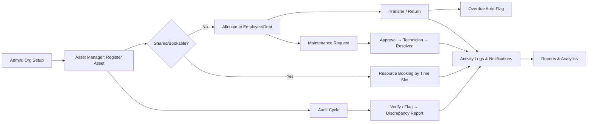
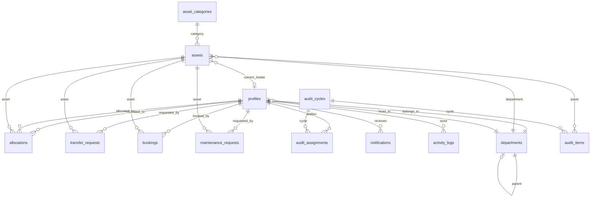

# AssetFlow — Engineering Design Specification v1.0

> **Authoritative blueprint for the Enterprise Asset & Resource Management System.**
> Every decision in this document traces directly to the [AssetFlow problem statement](file:///d:/computerlangs/The_Matrix/The_Matrix/AssetFlow%20problem%20statement.pdfAssetFlow%20problem%20statement.pdf) and the attached wireframe mockups.

---

## Table of Contents

1. [Product Vision & Scope Boundary](#1-product-vision--scope-boundary)
2. [User Roles & Permission Matrix](#2-user-roles--permission-matrix)
3. [Database Schema](#3-database-schema)
4. [Row Level Security (RLS) Strategy](#4-row-level-security-rls-strategy)
5. [Authentication & Authorization](#5-authentication--authorization)
6. [Frontend Architecture](#6-frontend-architecture)
7. [State Management Plan](#7-state-management-plan)
8. [Screen-by-Screen Specification](#8-screen-by-screen-specification)
9. [Notification System](#9-notification-system)
10. [Developer Assignment & API Contracts](#10-developer-assignment--api-contracts)
11. [Git Branching & Dependency Strategy](#11-git-branching--dependency-strategy)
12. [Deployment & Infrastructure](#12-deployment--infrastructure)
13. [Verification Plan](#13-verification-plan)

---

## 1. Product Vision & Scope Boundary

### 1.1 Vision

AssetFlow is a multi-tenant Enterprise Asset & Resource Management System. It enables organizations to register, allocate, transfer, book, maintain, and audit physical assets through clearly defined role-based workflows—all from a single, unified interface.

### 1.2 Strict Scope Boundary

> [!CAUTION]
> The following are **explicitly OUT OF SCOPE** per the problem statement. No developer may implement them:
> - Purchasing / Procurement workflows
> - Invoicing, Billing, or Accounting integrations
> - Depreciation calculations or financial asset valuation
> - Multi-organization / tenant switching (single org assumed)
> - External API integrations (no third-party connectors)
> - Chat, messaging, or collaboration features
> - Mobile-native apps (web responsive only)

### 1.3 Core Workflow Summary



---

## 2. User Roles & Permission Matrix

### 2.1 Role Definitions

| Role | Source of Assignment | Description |
|---|---|---|
| **Employee** | Self-signup (default) | Base role. Views own assets, books shared resources, raises maintenance/transfer/return requests. |
| **Department Head** | Promoted by Admin from Employee Directory (Screen 3C) | All Employee permissions + approves allocation/transfer within their department, views department-level assets. |
| **Asset Manager** | Promoted by Admin from Employee Directory (Screen 3C) | All Employee permissions + registers assets, approves transfers/maintenance/returns globally, manages audit discrepancies. |
| **Admin** | Promoted by Admin from Employee Directory (Screen 3C) | Full system control: org setup (departments, categories, employee roles), audit cycles, org-wide analytics. Does NOT self-assign at signup. |

> [!IMPORTANT]
> **Signup creates Employee accounts ONLY.** There is no role selector at signup. The first Admin must be seeded via a Supabase migration script (Developer A's responsibility).

### 2.2 Permission Matrix

| Action | Employee | Dept Head | Asset Manager | Admin |
|---|---|---|---|---|
| View own allocated assets | ✅ | ✅ | ✅ | ✅ |
| View department assets | ❌ | ✅ (own dept) | ✅ (all) | ✅ (all) |
| Register asset | ❌ | ❌ | ✅ | ❌ |
| Allocate asset | ❌ | ❌ | ✅ | ❌ |
| Approve transfer (own dept) | ❌ | ✅ | ✅ | ❌ |
| Approve transfer (cross-dept) | ❌ | ❌ | ✅ | ❌ |
| Initiate transfer/return request | ✅ | ✅ | ✅ | ❌ |
| Book shared resource | ✅ | ✅ | ✅ | ❌ |
| Raise maintenance request | ✅ | ✅ | ✅ | ❌ |
| Approve maintenance | ❌ | ❌ | ✅ | ❌ |
| Manage departments/categories | ❌ | ❌ | ❌ | ✅ |
| Promote/demote roles | ❌ | ❌ | ❌ | ✅ |
| Create audit cycle | ❌ | ❌ | ❌ | ✅ |
| Act as auditor | ✅ | ✅ | ✅ | ✅ |
| View org-wide analytics | ❌ | ❌ | ✅ | ✅ |
| View activity logs | Own only | Dept | All | All |

---

## 3. Database Schema

### 3.1 Enums

```sql
-- Asset lifecycle statuses (Screen 4)
CREATE TYPE asset_status AS ENUM (
  'available',
  'allocated',
  'reserved',
  'under_maintenance',
  'lost',
  'retired',
  'disposed'
);

-- User roles
CREATE TYPE user_role AS ENUM (
  'employee',
  'department_head',
  'asset_manager',
  'admin'
);

-- Transfer workflow states (Screen 5)
CREATE TYPE transfer_status AS ENUM (
  'requested',
  'approved',
  'rejected',
  'completed'
);

-- Booking states (Screen 6)
CREATE TYPE booking_status AS ENUM (
  'upcoming',
  'ongoing',
  'completed',
  'cancelled'
);

-- Maintenance workflow states (Screen 7)
CREATE TYPE maintenance_status AS ENUM (
  'pending',
  'approved',
  'rejected',
  'technician_assigned',
  'in_progress',
  'resolved'
);

-- Maintenance priority
CREATE TYPE maintenance_priority AS ENUM (
  'low',
  'medium',
  'high',
  'critical'
);

-- Audit item verification status (Screen 8)
CREATE TYPE audit_item_status AS ENUM (
  'pending',
  'verified',
  'missing',
  'damaged'
);

-- Audit cycle state
CREATE TYPE audit_cycle_status AS ENUM (
  'open',
  'in_progress',
  'closed'
);

-- Department status
CREATE TYPE entity_status AS ENUM (
  'active',
  'inactive'
);

-- Notification types (Screen 10)
CREATE TYPE notification_type AS ENUM (
  'asset_assigned',
  'maintenance_approved',
  'maintenance_rejected',
  'booking_confirmed',
  'booking_cancelled',
  'booking_reminder',
  'transfer_approved',
  'transfer_rejected',
  'overdue_return_alert',
  'audit_discrepancy_flagged',
  'role_changed'
);
```

### 3.2 Tables

#### 3.2.1 `profiles` — User profiles linked to Supabase Auth

```sql
CREATE TABLE profiles (
  id            UUID PRIMARY KEY REFERENCES auth.users(id) ON DELETE CASCADE,
  full_name     TEXT NOT NULL,
  email         TEXT NOT NULL UNIQUE,
  role          user_role NOT NULL DEFAULT 'employee',
  department_id UUID REFERENCES departments(id) ON DELETE SET NULL,
  status        entity_status NOT NULL DEFAULT 'active',
  avatar_url    TEXT,
  created_at    TIMESTAMPTZ NOT NULL DEFAULT now(),
  updated_at    TIMESTAMPTZ NOT NULL DEFAULT now()
);
-- Index for role-based queries
CREATE INDEX idx_profiles_role ON profiles(role);
CREATE INDEX idx_profiles_department ON profiles(department_id);
```

#### 3.2.2 `departments`

```sql
CREATE TABLE departments (
  id                UUID PRIMARY KEY DEFAULT gen_random_uuid(),
  name              TEXT NOT NULL,
  head_id           UUID REFERENCES profiles(id) ON DELETE SET NULL,
  parent_department_id UUID REFERENCES departments(id) ON DELETE SET NULL,
  status            entity_status NOT NULL DEFAULT 'active',
  created_at        TIMESTAMPTZ NOT NULL DEFAULT now(),
  updated_at        TIMESTAMPTZ NOT NULL DEFAULT now()
);
CREATE INDEX idx_departments_head ON departments(head_id);
CREATE INDEX idx_departments_parent ON departments(parent_department_id);
```

#### 3.2.3 `asset_categories`

```sql
CREATE TABLE asset_categories (
  id              UUID PRIMARY KEY DEFAULT gen_random_uuid(),
  name            TEXT NOT NULL UNIQUE,
  description     TEXT,
  custom_fields   JSONB DEFAULT '[]'::jsonb,
  -- e.g. [{"field_name":"warranty_period","field_type":"number","unit":"months"}]
  created_at      TIMESTAMPTZ NOT NULL DEFAULT now(),
  updated_at      TIMESTAMPTZ NOT NULL DEFAULT now()
);
```

#### 3.2.4 `assets`

```sql
CREATE TABLE assets (
  id                UUID PRIMARY KEY DEFAULT gen_random_uuid(),
  asset_tag         TEXT NOT NULL UNIQUE,
  -- Auto-generated: AF-0001, AF-0002 etc.
  name              TEXT NOT NULL,
  category_id       UUID NOT NULL REFERENCES asset_categories(id) ON DELETE RESTRICT,
  serial_number     TEXT,
  acquisition_date  DATE,
  acquisition_cost  NUMERIC(12,2),
  -- For ranking/reports only — NOT accounting
  condition         TEXT DEFAULT 'new',
  -- new, good, fair, poor
  location          TEXT,
  status            asset_status NOT NULL DEFAULT 'available',
  is_bookable       BOOLEAN NOT NULL DEFAULT false,
  -- "shared/bookable" flag from Screen 4
  department_id     UUID REFERENCES departments(id) ON DELETE SET NULL,
  photo_url         TEXT,
  documents         JSONB DEFAULT '[]'::jsonb,
  -- Array of {url, filename}
  custom_field_values JSONB DEFAULT '{}'::jsonb,
  -- Values matching category's custom_fields
  current_holder_id UUID REFERENCES profiles(id) ON DELETE SET NULL,
  expected_return_date DATE,
  registered_by     UUID NOT NULL REFERENCES profiles(id),
  created_at        TIMESTAMPTZ NOT NULL DEFAULT now(),
  updated_at        TIMESTAMPTZ NOT NULL DEFAULT now()
);
CREATE INDEX idx_assets_status ON assets(status);
CREATE INDEX idx_assets_category ON assets(category_id);
CREATE INDEX idx_assets_department ON assets(department_id);
CREATE INDEX idx_assets_tag ON assets(asset_tag);
CREATE INDEX idx_assets_holder ON assets(current_holder_id);
CREATE INDEX idx_assets_bookable ON assets(is_bookable) WHERE is_bookable = true;
```

**Asset Tag Generation** — Use a PostgreSQL sequence + trigger:

```sql
CREATE SEQUENCE asset_tag_seq START 1;

CREATE OR REPLACE FUNCTION generate_asset_tag()
RETURNS TRIGGER AS $$
BEGIN
  NEW.asset_tag := 'AF-' || LPAD(nextval('asset_tag_seq')::TEXT, 4, '0');
  RETURN NEW;
END;
$$ LANGUAGE plpgsql;

CREATE TRIGGER trg_asset_tag
  BEFORE INSERT ON assets
  FOR EACH ROW
  WHEN (NEW.asset_tag IS NULL)
  EXECUTE FUNCTION generate_asset_tag();
```

#### 3.2.5 `allocations` — Allocation & Return history (Screen 5)

```sql
CREATE TABLE allocations (
  id                UUID PRIMARY KEY DEFAULT gen_random_uuid(),
  asset_id          UUID NOT NULL REFERENCES assets(id) ON DELETE CASCADE,
  allocated_to      UUID NOT NULL REFERENCES profiles(id),
  allocated_by      UUID NOT NULL REFERENCES profiles(id),
  department_id     UUID REFERENCES departments(id),
  allocated_at      TIMESTAMPTZ NOT NULL DEFAULT now(),
  expected_return   DATE,
  returned_at       TIMESTAMPTZ,
  return_condition  TEXT,
  -- Condition check-in notes on return
  return_notes      TEXT,
  is_active         BOOLEAN NOT NULL DEFAULT true,
  created_at        TIMESTAMPTZ NOT NULL DEFAULT now()
);
CREATE INDEX idx_allocations_asset ON allocations(asset_id);
CREATE INDEX idx_allocations_holder ON allocations(allocated_to);
CREATE INDEX idx_allocations_active ON allocations(is_active) WHERE is_active = true;
CREATE INDEX idx_allocations_overdue ON allocations(expected_return)
  WHERE is_active = true AND expected_return IS NOT NULL;
```

#### 3.2.6 `transfer_requests` — Transfer workflow (Screen 5)

```sql
CREATE TABLE transfer_requests (
  id              UUID PRIMARY KEY DEFAULT gen_random_uuid(),
  asset_id        UUID NOT NULL REFERENCES assets(id) ON DELETE CASCADE,
  from_holder_id  UUID NOT NULL REFERENCES profiles(id),
  to_holder_id    UUID NOT NULL REFERENCES profiles(id),
  requested_by    UUID NOT NULL REFERENCES profiles(id),
  status          transfer_status NOT NULL DEFAULT 'requested',
  approved_by     UUID REFERENCES profiles(id),
  reason          TEXT,
  approved_at     TIMESTAMPTZ,
  completed_at    TIMESTAMPTZ,
  created_at      TIMESTAMPTZ NOT NULL DEFAULT now(),
  updated_at      TIMESTAMPTZ NOT NULL DEFAULT now()
);
CREATE INDEX idx_transfers_asset ON transfer_requests(asset_id);
CREATE INDEX idx_transfers_status ON transfer_requests(status);
```

#### 3.2.7 `bookings` — Resource booking (Screen 6)

```sql
CREATE TABLE bookings (
  id            UUID PRIMARY KEY DEFAULT gen_random_uuid(),
  asset_id      UUID NOT NULL REFERENCES assets(id) ON DELETE CASCADE,
  booked_by     UUID NOT NULL REFERENCES profiles(id),
  start_time    TIMESTAMPTZ NOT NULL,
  end_time      TIMESTAMPTZ NOT NULL,
  status        booking_status NOT NULL DEFAULT 'upcoming',
  notes         TEXT,
  cancelled_at  TIMESTAMPTZ,
  created_at    TIMESTAMPTZ NOT NULL DEFAULT now(),
  updated_at    TIMESTAMPTZ NOT NULL DEFAULT now(),
  -- Prevent end before start
  CONSTRAINT chk_booking_time CHECK (end_time > start_time)
);
CREATE INDEX idx_bookings_asset ON bookings(asset_id);
CREATE INDEX idx_bookings_time ON bookings(asset_id, start_time, end_time);
CREATE INDEX idx_bookings_user ON bookings(booked_by);
CREATE INDEX idx_bookings_status ON bookings(status);
```

**Overlap Prevention** — Database-level exclusion constraint:

```sql
CREATE EXTENSION IF NOT EXISTS btree_gist;

ALTER TABLE bookings
  ADD CONSTRAINT no_overlapping_bookings
  EXCLUDE USING gist (
    asset_id WITH =,
    tstzrange(start_time, end_time) WITH &&
  )
  WHERE (status NOT IN ('cancelled', 'completed'));
```

> [!IMPORTANT]
> This exclusion constraint is the **definitive guard** against double-booking. The frontend must also validate before submission, but the DB is the final authority. Per the problem statement: *"Two people can't book the same room at overlapping times."*

#### 3.2.8 `maintenance_requests` — Maintenance workflow (Screen 7)

```sql
CREATE TABLE maintenance_requests (
  id              UUID PRIMARY KEY DEFAULT gen_random_uuid(),
  asset_id        UUID NOT NULL REFERENCES assets(id) ON DELETE CASCADE,
  requested_by    UUID NOT NULL REFERENCES profiles(id),
  description     TEXT NOT NULL,
  priority        maintenance_priority NOT NULL DEFAULT 'medium',
  status          maintenance_status NOT NULL DEFAULT 'pending',
  photo_url       TEXT,
  approved_by     UUID REFERENCES profiles(id),
  technician_id   UUID REFERENCES profiles(id),
  resolution_notes TEXT,
  approved_at     TIMESTAMPTZ,
  assigned_at     TIMESTAMPTZ,
  started_at      TIMESTAMPTZ,
  resolved_at     TIMESTAMPTZ,
  created_at      TIMESTAMPTZ NOT NULL DEFAULT now(),
  updated_at      TIMESTAMPTZ NOT NULL DEFAULT now()
);
CREATE INDEX idx_maintenance_asset ON maintenance_requests(asset_id);
CREATE INDEX idx_maintenance_status ON maintenance_requests(status);
```

**Auto-update asset status on maintenance approval/resolution** — Database trigger:

```sql
CREATE OR REPLACE FUNCTION handle_maintenance_status_change()
RETURNS TRIGGER AS $$
BEGIN
  IF NEW.status = 'approved' AND OLD.status = 'pending' THEN
    UPDATE assets SET status = 'under_maintenance', updated_at = now()
    WHERE id = NEW.asset_id;
  ELSIF NEW.status = 'resolved' AND OLD.status IN ('in_progress', 'technician_assigned') THEN
    UPDATE assets SET status = 'available', updated_at = now()
    WHERE id = NEW.asset_id;
  END IF;
  RETURN NEW;
END;
$$ LANGUAGE plpgsql SECURITY DEFINER;

CREATE TRIGGER trg_maintenance_status
  AFTER UPDATE OF status ON maintenance_requests
  FOR EACH ROW
  EXECUTE FUNCTION handle_maintenance_status_change();
```

#### 3.2.9 `audit_cycles` — Audit management (Screen 8)

```sql
CREATE TABLE audit_cycles (
  id            UUID PRIMARY KEY DEFAULT gen_random_uuid(),
  name          TEXT NOT NULL,
  scope_type    TEXT NOT NULL CHECK (scope_type IN ('department', 'location')),
  scope_value   TEXT NOT NULL,
  -- department UUID or location string
  start_date    DATE NOT NULL,
  end_date      DATE NOT NULL,
  status        audit_cycle_status NOT NULL DEFAULT 'open',
  created_by    UUID NOT NULL REFERENCES profiles(id),
  closed_at     TIMESTAMPTZ,
  created_at    TIMESTAMPTZ NOT NULL DEFAULT now(),
  updated_at    TIMESTAMPTZ NOT NULL DEFAULT now(),
  CONSTRAINT chk_audit_dates CHECK (end_date >= start_date)
);
CREATE INDEX idx_audit_cycles_status ON audit_cycles(status);
```

#### 3.2.10 `audit_assignments` — Auditor assignments

```sql
CREATE TABLE audit_assignments (
  id              UUID PRIMARY KEY DEFAULT gen_random_uuid(),
  audit_cycle_id  UUID NOT NULL REFERENCES audit_cycles(id) ON DELETE CASCADE,
  auditor_id      UUID NOT NULL REFERENCES profiles(id),
  assigned_at     TIMESTAMPTZ NOT NULL DEFAULT now(),
  UNIQUE(audit_cycle_id, auditor_id)
);
```

#### 3.2.11 `audit_items` — Individual asset verification records

```sql
CREATE TABLE audit_items (
  id              UUID PRIMARY KEY DEFAULT gen_random_uuid(),
  audit_cycle_id  UUID NOT NULL REFERENCES audit_cycles(id) ON DELETE CASCADE,
  asset_id        UUID NOT NULL REFERENCES assets(id) ON DELETE CASCADE,
  auditor_id      UUID REFERENCES profiles(id),
  status          audit_item_status NOT NULL DEFAULT 'pending',
  notes           TEXT,
  verified_at     TIMESTAMPTZ,
  created_at      TIMESTAMPTZ NOT NULL DEFAULT now(),
  UNIQUE(audit_cycle_id, asset_id)
);
CREATE INDEX idx_audit_items_cycle ON audit_items(audit_cycle_id);
CREATE INDEX idx_audit_items_status ON audit_items(status);
```

**Auto-update asset status when audit cycle is closed and items are flagged as missing:**

```sql
CREATE OR REPLACE FUNCTION handle_audit_cycle_close()
RETURNS TRIGGER AS $$
BEGIN
  IF NEW.status = 'closed' AND OLD.status != 'closed' THEN
    -- Mark confirmed-missing assets as 'lost'
    UPDATE assets SET status = 'lost', updated_at = now()
    WHERE id IN (
      SELECT asset_id FROM audit_items
      WHERE audit_cycle_id = NEW.id AND status = 'missing'
    );
    NEW.closed_at := now();
  END IF;
  RETURN NEW;
END;
$$ LANGUAGE plpgsql SECURITY DEFINER;

CREATE TRIGGER trg_audit_cycle_close
  BEFORE UPDATE OF status ON audit_cycles
  FOR EACH ROW
  EXECUTE FUNCTION handle_audit_cycle_close();
```

#### 3.2.12 `notifications`

```sql
CREATE TABLE notifications (
  id            UUID PRIMARY KEY DEFAULT gen_random_uuid(),
  user_id       UUID NOT NULL REFERENCES profiles(id) ON DELETE CASCADE,
  type          notification_type NOT NULL,
  title         TEXT NOT NULL,
  message       TEXT NOT NULL,
  reference_id  UUID,
  -- Polymorphic FK: the related entity (asset, booking, transfer, etc.)
  reference_type TEXT,
  -- 'asset', 'booking', 'transfer', 'maintenance', 'audit'
  is_read       BOOLEAN NOT NULL DEFAULT false,
  created_at    TIMESTAMPTZ NOT NULL DEFAULT now()
);
CREATE INDEX idx_notifications_user ON notifications(user_id);
CREATE INDEX idx_notifications_unread ON notifications(user_id, is_read)
  WHERE is_read = false;
```

#### 3.2.13 `activity_logs` — Full audit trail (Screen 10)

```sql
CREATE TABLE activity_logs (
  id            UUID PRIMARY KEY DEFAULT gen_random_uuid(),
  actor_id      UUID NOT NULL REFERENCES profiles(id),
  action        TEXT NOT NULL,
  -- e.g. 'asset.registered', 'transfer.approved', 'audit.closed'
  entity_type   TEXT NOT NULL,
  -- 'asset', 'allocation', 'transfer', 'booking', 'maintenance', 'audit', 'profile', 'department'
  entity_id     UUID NOT NULL,
  metadata      JSONB DEFAULT '{}'::jsonb,
  -- Snapshot of relevant data at action time
  created_at    TIMESTAMPTZ NOT NULL DEFAULT now()
);
CREATE INDEX idx_activity_actor ON activity_logs(actor_id);
CREATE INDEX idx_activity_entity ON activity_logs(entity_type, entity_id);
CREATE INDEX idx_activity_created ON activity_logs(created_at DESC);
```

### 3.3 Entity Relationship Diagram



### 3.4 Database Views (for Dashboard KPIs & Reports)

```sql
-- Dashboard KPI view
CREATE VIEW dashboard_kpis AS
SELECT
  COUNT(*) FILTER (WHERE status = 'available') AS assets_available,
  COUNT(*) FILTER (WHERE status = 'allocated') AS assets_allocated,
  (SELECT COUNT(*) FROM maintenance_requests
   WHERE status IN ('approved','technician_assigned','in_progress')
   AND DATE(created_at) = CURRENT_DATE) AS maintenance_today,
  (SELECT COUNT(*) FROM bookings
   WHERE status IN ('upcoming','ongoing')) AS active_bookings,
  (SELECT COUNT(*) FROM transfer_requests
   WHERE status = 'requested') AS pending_transfers,
  (SELECT COUNT(*) FROM allocations
   WHERE is_active = true AND expected_return IS NOT NULL
   AND expected_return < CURRENT_DATE) AS overdue_returns
FROM assets;

-- Overdue allocations view
CREATE VIEW overdue_allocations AS
SELECT
  a.id AS allocation_id,
  a.asset_id,
  ast.asset_tag,
  ast.name AS asset_name,
  a.allocated_to,
  p.full_name AS holder_name,
  a.expected_return,
  CURRENT_DATE - a.expected_return AS days_overdue
FROM allocations a
JOIN assets ast ON ast.id = a.asset_id
JOIN profiles p ON p.id = a.allocated_to
WHERE a.is_active = true
  AND a.expected_return IS NOT NULL
  AND a.expected_return < CURRENT_DATE
ORDER BY a.expected_return ASC;
```

---

## 4. Row Level Security (RLS) Strategy

### 4.1 Global Principles

1. **Every table has RLS enabled.** No exceptions.
2. **Authenticated users can read their own profile.** Admins and Asset Managers can read all profiles.
3. **Write operations are gated by role checks** using `auth.uid()` and a helper function.
4. **Service-role key is NEVER exposed to the frontend.** All client operations go through the `anon` key + RLS.

### 4.2 Helper Function

```sql
CREATE OR REPLACE FUNCTION get_user_role()
RETURNS user_role AS $$
  SELECT role FROM profiles WHERE id = auth.uid();
$$ LANGUAGE sql SECURITY DEFINER STABLE;

CREATE OR REPLACE FUNCTION get_user_department()
RETURNS UUID AS $$
  SELECT department_id FROM profiles WHERE id = auth.uid();
$$ LANGUAGE sql SECURITY DEFINER STABLE;
```

### 4.3 RLS Policies Per Table

#### `profiles`

| Policy | Operation | Rule |
|---|---|---|
| `profiles_select_own` | SELECT | `id = auth.uid()` |
| `profiles_select_all` | SELECT | `get_user_role() IN ('admin', 'asset_manager')` |
| `profiles_select_dept` | SELECT | `get_user_role() = 'department_head' AND department_id = get_user_department()` |
| `profiles_update_own` | UPDATE | `id = auth.uid()` (limited to `full_name, avatar_url`) |
| `profiles_update_role` | UPDATE | `get_user_role() = 'admin'` (can update `role, department_id, status`) |
| `profiles_insert` | INSERT | `id = auth.uid()` (via auth trigger on signup) |

#### `departments`

| Policy | Operation | Rule |
|---|---|---|
| `departments_select` | SELECT | Authenticated (all roles can read departments) |
| `departments_insert` | INSERT | `get_user_role() = 'admin'` |
| `departments_update` | UPDATE | `get_user_role() = 'admin'` |

#### `asset_categories`

| Policy | Operation | Rule |
|---|---|---|
| `categories_select` | SELECT | Authenticated |
| `categories_insert` | INSERT | `get_user_role() = 'admin'` |
| `categories_update` | UPDATE | `get_user_role() = 'admin'` |

#### `assets`

| Policy | Operation | Rule |
|---|---|---|
| `assets_select_all` | SELECT | Authenticated (all can search/view assets) |
| `assets_insert` | INSERT | `get_user_role() = 'asset_manager'` |
| `assets_update` | UPDATE | `get_user_role() IN ('asset_manager', 'admin')` |

#### `allocations`

| Policy | Operation | Rule |
|---|---|---|
| `alloc_select_own` | SELECT | `allocated_to = auth.uid()` |
| `alloc_select_manager` | SELECT | `get_user_role() IN ('asset_manager', 'admin')` |
| `alloc_select_dept_head` | SELECT | `get_user_role() = 'department_head' AND department_id = get_user_department()` |
| `alloc_insert` | INSERT | `get_user_role() = 'asset_manager'` |
| `alloc_update` | UPDATE | `get_user_role() = 'asset_manager'` |

#### `transfer_requests`

| Policy | Operation | Rule |
|---|---|---|
| `transfer_select` | SELECT | `requested_by = auth.uid() OR from_holder_id = auth.uid() OR to_holder_id = auth.uid() OR get_user_role() IN ('asset_manager', 'admin', 'department_head')` |
| `transfer_insert` | INSERT | Authenticated (any role can request) |
| `transfer_update` | UPDATE | `get_user_role() IN ('asset_manager', 'department_head')` with department scoping for dept heads |

#### `bookings`

| Policy | Operation | Rule |
|---|---|---|
| `bookings_select` | SELECT | Authenticated (all can view bookings for a resource) |
| `bookings_insert` | INSERT | Authenticated (employee+) |
| `bookings_update_own` | UPDATE | `booked_by = auth.uid()` (cancel own booking) |
| `bookings_update_manager` | UPDATE | `get_user_role() IN ('asset_manager', 'admin')` |

#### `maintenance_requests`

| Policy | Operation | Rule |
|---|---|---|
| `maint_select_own` | SELECT | `requested_by = auth.uid()` |
| `maint_select_manager` | SELECT | `get_user_role() IN ('asset_manager', 'admin')` |
| `maint_insert` | INSERT | Authenticated |
| `maint_update` | UPDATE | `get_user_role() = 'asset_manager'` |

#### `audit_cycles`, `audit_assignments`, `audit_items`

| Policy | Operation | Rule |
|---|---|---|
| `audit_select` | SELECT | `get_user_role() IN ('admin', 'asset_manager')` OR user is an assigned auditor |
| `audit_cycle_insert` | INSERT | `get_user_role() = 'admin'` |
| `audit_cycle_update` | UPDATE | `get_user_role() = 'admin'` |
| `audit_item_update` | UPDATE | User is the assigned auditor for this item, OR `get_user_role() = 'admin'` |

#### `notifications`

| Policy | Operation | Rule |
|---|---|---|
| `notif_select` | SELECT | `user_id = auth.uid()` |
| `notif_update` | UPDATE | `user_id = auth.uid()` (mark as read) |
| `notif_insert` | INSERT | Via `SECURITY DEFINER` functions only (triggers) |

#### `activity_logs`

| Policy | Operation | Rule |
|---|---|---|
| `logs_select_own` | SELECT | `actor_id = auth.uid()` (employees see own actions) |
| `logs_select_dept` | SELECT | `get_user_role() = 'department_head'` + actor in same dept |
| `logs_select_all` | SELECT | `get_user_role() IN ('admin', 'asset_manager')` |
| `logs_insert` | INSERT | Via `SECURITY DEFINER` functions only |

---

## 5. Authentication & Authorization

### 5.1 Supabase Auth Setup

```
Provider: Email/Password (Supabase built-in)
Confirmation: Email confirmation enabled
Password recovery: Supabase magic link / reset flow
Session: JWT-based, 1-hour access token, 7-day refresh
```

### 5.2 Signup Flow

1. User signs up via Supabase Auth (`supabase.auth.signUp()`).
2. A database trigger auto-creates a `profiles` row with `role = 'employee'`:

```sql
CREATE OR REPLACE FUNCTION handle_new_user()
RETURNS TRIGGER AS $$
BEGIN
  INSERT INTO profiles (id, full_name, email, role)
  VALUES (
    NEW.id,
    COALESCE(NEW.raw_user_meta_data->>'full_name', split_part(NEW.email, '@', 1)),
    NEW.email,
    'employee'
  );
  RETURN NEW;
END;
$$ LANGUAGE plpgsql SECURITY DEFINER;

CREATE TRIGGER on_auth_user_created
  AFTER INSERT ON auth.users
  FOR EACH ROW
  EXECUTE FUNCTION handle_new_user();
```

### 5.3 First Admin Seeding

> [!WARNING]
> The very first Admin account must be seeded via a Supabase migration. Developer A must include this in the initial seed script:

```sql
-- In supabase/seed.sql
-- After creating the user via Supabase Auth CLI or dashboard:
UPDATE profiles SET role = 'admin' WHERE email = 'admin@assetflow.com';
```

### 5.4 Frontend Auth Guard

```
Route Protection Strategy:
- PublicRoute: /login, /signup, /forgot-password
- ProtectedRoute: All other routes (requires authenticated session)
- RoleGate: Wraps specific routes/components to check user role
  - e.g., <RoleGate allowed={['admin']}> around Organization Setup
```

---

## 6. Frontend Architecture

### 6.1 Technology Stack

| Layer | Technology | Rationale |
|---|---|---|
| Framework | React 18+ (Vite) | Fast dev server, tree-shaking, Vercel-optimized |
| Routing | React Router v6 | Declarative, nested routes |
| State Management | Zustand | Minimal boilerplate, no context provider hell |
| Server State | TanStack Query (React Query) v5 | Caching, background refetch, optimistic updates |
| Styling | CSS Modules + CSS Custom Properties | Scoped styles, zero runtime overhead, theming |
| Forms | React Hook Form + Zod | Performant forms with schema validation |
| Calendar | react-big-calendar or FullCalendar | Resource booking calendar view (Screen 6) |
| Charts | Recharts | Lightweight, composable chart components (Screen 9) |
| Icons | Lucide React | Consistent icon set |
| Supabase Client | @supabase/supabase-js v2 | Official client for REST + Realtime |
| Date | date-fns | Lightweight date manipulation |
| Toasts | Sonner | Minimal toast notifications |

### 6.2 Project Structure

```
src/
├── main.jsx                    # Entry point
├── App.jsx                     # Root layout + router
├── supabase.js                 # Supabase client singleton
│
├── assets/                     # Static assets (images, fonts)
│
├── styles/                     # Global styles
│   ├── variables.css           # Design tokens (colors, spacing, typography)
│   ├── reset.css               # CSS reset
│   └── global.css              # Global utilities
│
├── hooks/                      # Shared React hooks
│   ├── useAuth.js              # Auth state + session management
│   ├── useProfile.js           # Current user profile
│   ├── useSupabase.js          # Supabase client accessor
│   └── useRealtime.js          # Supabase Realtime subscriptions
│
├── lib/                        # Utility functions (pure, no React)
│   ├── constants.js            # Enums, status labels, colors
│   ├── formatters.js           # Date, currency, status formatters
│   ├── validators.js           # Zod schemas
│   └── permissions.js          # Role-based permission checks
│
├── stores/                     # Zustand stores
│   ├── authStore.js            # Auth session + user profile
│   ├── uiStore.js              # Sidebar state, modals, theme
│   └── notificationStore.js    # Unread count, realtime badge
│
├── services/                   # Supabase API abstraction layer
│   ├── auth.service.js         # signup, login, logout, resetPassword
│   ├── profiles.service.js     # CRUD profiles
│   ├── departments.service.js  # CRUD departments
│   ├── categories.service.js   # CRUD categories
│   ├── assets.service.js       # CRUD assets, search, filters
│   ├── allocations.service.js  # allocate, return, history
│   ├── transfers.service.js    # request, approve, reject
│   ├── bookings.service.js     # book, cancel, overlap check
│   ├── maintenance.service.js  # raise, approve, assign, resolve
│   ├── audits.service.js       # cycles, assignments, items, close
│   ├── notifications.service.js
│   ├── activityLogs.service.js
│   └── analytics.service.js    # Aggregation queries for reports
│
├── components/                 # Shared UI components
│   ├── layout/
│   │   ├── AppShell.jsx        # Sidebar + topbar + content area
│   │   ├── Sidebar.jsx         # Navigation (role-aware)
│   │   ├── Topbar.jsx          # User menu, notifications bell
│   │   └── PageHeader.jsx      # Title + breadcrumb + actions
│   │
│   ├── ui/                     # Primitive UI kit
│   │   ├── Button.jsx
│   │   ├── Input.jsx
│   │   ├── Select.jsx
│   │   ├── Modal.jsx
│   │   ├── Table.jsx           # Sortable, filterable data table
│   │   ├── Badge.jsx           # Status badges
│   │   ├── Card.jsx            # KPI card
│   │   ├── Tabs.jsx
│   │   ├── SearchBar.jsx
│   │   ├── EmptyState.jsx
│   │   ├── Loader.jsx
│   │   ├── Avatar.jsx
│   │   └── ConfirmDialog.jsx
│   │
│   ├── auth/
│   │   ├── ProtectedRoute.jsx
│   │   └── RoleGate.jsx
│   │
│   ├── data-display/
│   │   ├── StatusBadge.jsx     # Colored status pills
│   │   ├── AssetCard.jsx       # Asset summary card
│   │   ├── KPICard.jsx         # Dashboard metric card
│   │   ├── TimelineEntry.jsx   # Activity log entry
│   │   └── NotificationItem.jsx
│   │
│   └── forms/
│       ├── AssetForm.jsx       # Register/edit asset
│       ├── DepartmentForm.jsx
│       ├── CategoryForm.jsx
│       ├── AllocationForm.jsx
│       ├── TransferForm.jsx
│       ├── BookingForm.jsx
│       ├── MaintenanceForm.jsx
│       └── AuditCycleForm.jsx
│
├── pages/                      # Route-level page components
│   ├── auth/
│   │   ├── LoginPage.jsx       # Screen 1
│   │   ├── SignupPage.jsx      # Screen 1
│   │   └── ForgotPasswordPage.jsx
│   │
│   ├── DashboardPage.jsx       # Screen 2
│   │
│   ├── org-setup/              # Screen 3 (Admin only)
│   │   ├── OrgSetupPage.jsx    # Tab container
│   │   ├── DepartmentsTab.jsx  # Tab A
│   │   ├── CategoriesTab.jsx   # Tab B
│   │   └── EmployeeDirectoryTab.jsx  # Tab C
│   │
│   ├── AssetsPage.jsx          # Screen 4 — Registration & Directory
│   ├── AssetDetailPage.jsx     # Per-asset detail + history
│   │
│   ├── AllocationPage.jsx      # Screen 5
│   ├── BookingsPage.jsx        # Screen 6
│   ├── MaintenancePage.jsx     # Screen 7
│   ├── AuditPage.jsx           # Screen 8
│   ├── ReportsPage.jsx         # Screen 9
│   ├── ActivityLogsPage.jsx    # Screen 10
│   └── NotificationsPage.jsx   # Screen 10 (notifications tab)
│
└── routes.jsx                  # Route definitions with guards
```

### 6.3 Route Map

```
/login                      → LoginPage          (Public)
/signup                     → SignupPage          (Public)
/forgot-password            → ForgotPasswordPage  (Public)
/                           → DashboardPage       (Protected, all roles)
/org-setup                  → OrgSetupPage        (Protected, Admin only)
/assets                     → AssetsPage          (Protected, all roles)
/assets/:id                 → AssetDetailPage     (Protected, all roles)
/allocation                 → AllocationPage      (Protected, Asset Manager + above)
/bookings                   → BookingsPage        (Protected, all roles)
/maintenance                → MaintenancePage     (Protected, all roles)
/audit                      → AuditPage           (Protected, Admin + Asset Manager)
/reports                    → ReportsPage         (Protected, Asset Manager + Admin)
/activity                   → ActivityLogsPage    (Protected, all roles, filtered by permissions)
/notifications              → NotificationsPage   (Protected, all roles)
```

### 6.4 Sidebar Navigation (Role-Aware)

```
All Roles:
  ├── Dashboard
  ├── Assets
  ├── Allocation & Transfer
  ├── Resource Booking
  ├── Maintenance
  ├── Reports (Asset Manager, Admin only)
  ├── Audit (Admin, Asset Manager only)
  └── Activity / Notifications

Admin Only:
  ├── Organization Setup (appears second, after Dashboard)
```

> [!NOTE]
> The sidebar must dynamically show/hide items based on the user's `role` from `authStore`. This is a **client-side UX filter only**—RLS provides the actual security gate.

---

## 7. State Management Plan

### 7.1 Client State (Zustand)

| Store | Keys | Purpose |
|---|---|---|
| `authStore` | `session`, `user`, `profile`, `isLoading` | Current auth session + profile with role |
| `uiStore` | `sidebarOpen`, `activeModal`, `theme` | UI chrome state |
| `notificationStore` | `unreadCount`, `latestNotifications` | Badge count, realtime-fed |

### 7.2 Server State (TanStack Query)

All data fetching uses TanStack Query with these conventions:

| Query Key Pattern | Service | Stale Time |
|---|---|---|
| `['dashboard', 'kpis']` | `analytics.service` | 30s |
| `['assets', filters]` | `assets.service` | 60s |
| `['asset', id]` | `assets.service` | 60s |
| `['allocations', filters]` | `allocations.service` | 30s |
| `['transfers', filters]` | `transfers.service` | 30s |
| `['bookings', assetId, dateRange]` | `bookings.service` | 15s |
| `['maintenance', filters]` | `maintenance.service` | 30s |
| `['audit-cycles']` | `audits.service` | 60s |
| `['audit-items', cycleId]` | `audits.service` | 30s |
| `['notifications']` | `notifications.service` | 10s |
| `['activity-logs', filters]` | `activityLogs.service` | 60s |
| `['departments']` | `departments.service` | 5min |
| `['categories']` | `categories.service` | 5min |
| `['profiles', filters]` | `profiles.service` | 60s |

### 7.3 Realtime Subscriptions (Supabase Realtime)

```
Channel: notifications:{userId}
  → Table: notifications, filter: user_id=eq.{userId}
  → On INSERT: increment notificationStore.unreadCount, show toast

Channel: bookings:{assetId}  (when on Bookings page)
  → Table: bookings, filter: asset_id=eq.{assetId}
  → On INSERT/UPDATE: invalidate ['bookings', assetId] query

Channel: maintenance (when on Maintenance page, for Asset Managers)
  → Table: maintenance_requests
  → On INSERT/UPDATE: invalidate ['maintenance'] query
```

### 7.4 Optimistic Updates

Apply optimistic updates for:
- **Mark notification as read** (immediate UI feedback, revert on error)
- **Cancel booking** (immediate removal from list)
- **Mark audit item** (immediate status badge change)

All other mutations (allocations, transfers, maintenance approvals) wait for server confirmation because they involve business logic validation.

---

## 8. Screen-by-Screen Specification

### Screen 1 — Login / Signup

**Layout**: Centered card, AssetFlow logo + "AF" badge.

| Element | Behavior |
|---|---|
| Email input | Standard email validation |
| Password input | Min 8 chars, masked |
| "Forgot Password" link | Navigates to `/forgot-password`, triggers `supabase.auth.resetPasswordForEmail()` |
| Login button | `supabase.auth.signInWithPassword()` → redirects to `/` |
| "Create Account" link | Navigates to `/signup` |
| Signup form | Email + password + full name. **No role selector.** Calls `supabase.auth.signUp({ options: { data: { full_name } } })` |
| Post-signup | "Check your email for confirmation" message. Profile auto-created as `employee` via trigger. |

### Screen 2 — Dashboard

**Layout**: Grid of KPI cards + quick actions + recent activity feed.

| KPI Card | Data Source | Color Code |
|---|---|---|
| Available | `dashboard_kpis.assets_available` | Green |
| Allocated | `dashboard_kpis.assets_allocated` | Blue |
| Active Bookings | `dashboard_kpis.active_bookings` | Blue |
| Pending Transfers | `dashboard_kpis.pending_transfers` | Yellow |
| Maintenance Today | `dashboard_kpis.maintenance_today` | Orange |
| Upcoming Returns | Count from `allocations` where `expected_return` is within 7 days | Gray |

**Quick Actions** (role-gated buttons):
- Register Asset (Asset Manager only)
- Book Resource (all)
- Raise Maintenance (all)

**Alert Banner**: "X assets overdue for return – flagged for follow-up" linking to overdue allocation list.

**Recent Activity**: Last 10 activity log entries for the current user's permission scope.

### Screen 3 — Organization Setup (Admin Only)

**Tabs**: Departments | Categories | Employees (+ Add button for each)

**Tab A — Departments**:
- Table: Name, Head, Parent Department, Status, Actions
- Modal for Create/Edit: Name (required), Head (dropdown of profiles with `department_head` role or unassigned), Parent Department (dropdown of existing depts), Status toggle
- Deactivate: Soft-delete (`status = 'inactive'`), not hard delete

**Tab B — Categories**:
- Table: Name, Description, Custom Fields count, Actions
- Modal for Create/Edit: Name (required, unique), Description, Dynamic custom fields builder (field name + type: text/number/date)
- Custom fields example: "Warranty Period" (number, months) for Electronics

**Tab C — Employee Directory**:
- Table: Name, Email, Department, Role, Status, Actions
- Admin can **change role** via a dropdown in the row or an edit modal
- Admin can **assign department** via dropdown
- Admin can **deactivate** employee (soft)
- This is the **only place** roles are promoted/demoted. The wireframe confirms: *"Admin promotes an Employee to Department Head or Asset Manager here"*

### Screen 4 — Asset Registration & Directory

**Two modes**: Table/Grid view of all assets + Register modal/form.

**Register Form Fields**:
| Field | Type | Required | Notes |
|---|---|---|---|
| Name | Text | ✅ | |
| Category | Select (from Screen 3B) | ✅ | |
| Asset Tag | Auto-generated | — | Display as `AF-XXXX`, read-only |
| Serial Number | Text | ❌ | |
| Acquisition Date | Date picker | ❌ | |
| Acquisition Cost | Currency input | ❌ | For reports only |
| Condition | Select (New/Good/Fair/Poor) | ✅ | |
| Location | Text | ❌ | |
| Department | Select (from departments) | ❌ | |
| Photo | File upload → Supabase Storage | ❌ | |
| Documents | File upload (multiple) | ❌ | |
| Shared/Bookable | Toggle | ✅ | Default: off |
| Custom fields | Dynamic based on category | ❌ | |

**Directory Features**:
- Search by: Asset Tag, Serial Number, Name
- Filter by: Category, Status, Department, Location
- Each row shows: Asset Tag, Name, Category, Status (colored badge), Department, Location
- Click row → Asset Detail Page (`/assets/:id`)

**Asset Detail Page**:
- Full asset info card
- Two history tabs: **Allocation History** (from `allocations` table) + **Maintenance History** (from `maintenance_requests`)
- Current holder info (if allocated)
- Quick actions based on status: Allocate, Book (if bookable), Raise Maintenance, Transfer

### Screen 5 — Asset Allocation & Transfer

**Split view**: Left = allocation form, Right = allocation history.

**Allocate Form**:
| Field | Behavior |
|---|---|
| Asset selector | Searchable dropdown. Only shows assets with `status = 'available'` |
| Allocate to | Employee/department selector |
| Expected Return Date | Optional date picker |
| Notes | Optional text area |
| Submit | Creates `allocation` record, updates `assets.status → 'allocated'`, `assets.current_holder_id` |

**Conflict Rule** (critical per PDF):
> If an asset is already allocated, the system **blocks allocation**, shows the message *"Currently held by [Name]"*, and offers a **Transfer Request** button instead.

**Transfer Request Form** (opens when conflict is detected):
| Field | Behavior |
|---|---|
| Asset | Pre-filled (the conflicting asset) |
| From | Pre-filled (current holder) |
| To | Employee selector |
| Reason | Text area |
| Submit | Creates `transfer_requests` record with `status = 'requested'` |

**Transfer Approval**: Asset Manager or Department Head (for within-department) sees pending transfers and can Approve/Reject. On approval → auto re-allocation and history update.

**Return Flow**:
- "Return" button on active allocations
- Capture: Condition on return (dropdown), Check-in notes (text)
- On return: `allocations.is_active = false`, `allocations.returned_at = now()`, `assets.status = 'available'`, `assets.current_holder_id = NULL`

**Overdue Detection**: A Supabase Edge Function (or a cron-based Supabase function) runs daily:
```sql
-- Flag overdue allocations
SELECT id, asset_id, allocated_to, expected_return
FROM allocations
WHERE is_active = true
  AND expected_return IS NOT NULL
  AND expected_return < CURRENT_DATE;
```
Results feed the Dashboard banner and trigger `overdue_return_alert` notifications.

### Screen 6 — Resource Booking

**Layout**: Calendar view (left) + booking form (right).

**Calendar**:
- Shows existing bookings for the selected bookable asset
- Color-coded by status: Upcoming (blue), Ongoing (green), Completed (gray), Cancelled (red strikethrough)
- Day/Week/Month view toggle

**Booking Form**:
| Field | Type | Notes |
|---|---|---|
| Resource | Dropdown (assets where `is_bookable = true`) | |
| Date | Date picker | |
| Start Time | Time picker | |
| End Time | Time picker | Must be after start |
| Notes | Text | Optional |
| Submit | Button | Runs overlap check, then inserts |

**Overlap Validation** (two layers):
1. **Frontend pre-check** (UX, fast feedback):
```js
// In bookings.service.js
async function checkOverlap(assetId, startTime, endTime) {
  const { data } = await supabase
    .from('bookings')
    .select('id, start_time, end_time')
    .eq('asset_id', assetId)
    .not('status', 'in', '("cancelled","completed")')
    .or(`and(start_time.lt.${endTime},end_time.gt.${startTime})`);
  return data.length > 0;
}
```
2. **Database exclusion constraint** (final authority, as defined in §3.2.7)

**Per the PDF example**: Room B2 booked 9:00–10:00. Request for 9:30–10:30 → **REJECTED** (overlap). Request for 10:00–11:00 → **ACCEPTED** (adjacent, no overlap).

**Cancel/Reschedule**: User can cancel own upcoming bookings. Reschedule = cancel + rebook.

### Screen 7 — Maintenance Management

**Layout**: Kanban-style board showing requests by status.

**Columns**: Pending → Approved → Technician Assigned → In Progress → Resolved

**Raise Request Form**:
| Field | Type | Notes |
|---|---|---|
| Asset | Searchable dropdown | |
| Description | Text area | Required |
| Priority | Select (Low/Medium/High/Critical) | |
| Photo | File upload | Optional |
| Submit | Button | Creates with `status = 'pending'` |

**Approval Flow** (Asset Manager):
- Approve → status = `approved`, asset status → `under_maintenance`
- Reject → status = `rejected`, asset status unchanged

**Assignment** (Asset Manager):
- Assign technician (select from employee list) → status = `technician_assigned`

**Progress**:
- Technician marks "In Progress" → `in_progress`
- Technician marks "Resolved" with resolution notes → `resolved`, asset status → `available`

**Card Design** (per wireframe): Each card shows Asset Tag, Name, Priority badge, Status, Requester, Date. Cards move across columns.

### Screen 8 — Asset Audit

**Layout**: Audit cycle list + detail view.

**Create Audit Cycle** (Admin):
| Field | Type | Notes |
|---|---|---|
| Name | Text | e.g., "Q3 Engineering Dept Audit" |
| Scope Type | Radio: Department / Location | |
| Scope Value | Dropdown (department list) or text (location) | |
| Date Range | Start + End date pickers | |
| Auditors | Multi-select of employees | |

**On creation**:
1. Insert `audit_cycles` record
2. Insert `audit_assignments` for each auditor
3. Auto-populate `audit_items` by querying `assets` matching the scope (department or location)
4. Each `audit_item` starts as `status = 'pending'`

**Auditor Workflow**:
- Table of assets in the cycle: Asset Tag, Name, Expected Location, Status (dropdown: Verified/Missing/Damaged), Notes
- Auditor marks each item
- System shows running tally: `X assets flagged – Discrepancy report generated automatically`

**Close Audit Cycle** (Admin):
- Locks all items (no further edits)
- Auto-generates discrepancy report (items with `status != 'verified'`)
- Updates `assets.status = 'lost'` for confirmed-missing items (via DB trigger in §3.2.11)
- Status → `closed`

**Discrepancy Report**:
- Auto-generated list of flagged items
- Columns: Asset Tag, Expected Location, Audit Result, Notes
- Exportable (CSV/PDF)

### Screen 9 — Reports & Analytics

**Layout**: Multiple chart cards + summary lists + export button.

**Charts & Widgets**:

| Widget | Chart Type | Data Source |
|---|---|---|
| Utilization by Department | Bar chart | `assets` grouped by department + status |
| Maintenance Frequency | Bar chart | `maintenance_requests` grouped by asset/category |
| Most-Used Assets | Ranked list | `bookings` count per asset |
| Idle Assets | Ranked list | Assets with `status = 'available'` for > 30 days |
| Resource Booking Heatmap | Heatmap / matrix | `bookings` grouped by hour-of-day × day-of-week |
| Assets Due for Maintenance | List | Assets with recent maintenance history patterns |
| Assets Nearing Retirement | List | Assets older than configurable threshold |
| Department Allocation Summary | Table | Allocations grouped by department |

**Export**: "Export Report" button → CSV download for the currently visible report.

### Screen 10 — Activity Logs & Notifications

**Two tabs**: Activity | Notifications (+ optional: Bookings tab per wireframe)

**Activity Tab**:
- Chronological feed of `activity_logs`
- Each entry: Icon + "Laptop AF-0094 approved by Priya shah" + timestamp
- Filters: by entity type (assets, bookings, maintenance, audit), by date range, by actor
- Scoped by user role (employees see own, dept heads see dept, admin/managers see all)

**Notifications Tab**:
- List of `notifications` for current user
- Unread highlighted
- Mark as read (single or bulk)
- Click → navigate to the referenced entity
- Types (from PDF): Asset Assigned, Maintenance Approved/Rejected, Booking Confirmed/Cancelled/Reminder, Transfer Approved, Overdue Return Alert, Audit Discrepancy Flagged

---

## 9. Notification System

### 9.1 Notification Triggers (Database Functions)

Each notification is created via a `SECURITY DEFINER` function called from database triggers:

```sql
CREATE OR REPLACE FUNCTION create_notification(
  p_user_id UUID,
  p_type notification_type,
  p_title TEXT,
  p_message TEXT,
  p_ref_id UUID DEFAULT NULL,
  p_ref_type TEXT DEFAULT NULL
) RETURNS VOID AS $$
BEGIN
  INSERT INTO notifications (user_id, type, title, message, reference_id, reference_type)
  VALUES (p_user_id, p_type, p_title, p_message, p_ref_id, p_ref_type);
END;
$$ LANGUAGE plpgsql SECURITY DEFINER;
```

### 9.2 Trigger Map

| Event | Notification Type | Recipient |
|---|---|---|
| Asset allocated | `asset_assigned` | The employee it's allocated to |
| Transfer approved | `transfer_approved` | Requester + new holder |
| Transfer rejected | `transfer_rejected` | Requester |
| Maintenance approved | `maintenance_approved` | Requester |
| Maintenance rejected | `maintenance_rejected` | Requester |
| Booking created | `booking_confirmed` | Booker |
| Booking cancelled | `booking_cancelled` | Booker |
| Booking starting in 15 min | `booking_reminder` | Booker (via scheduled function) |
| Overdue return detected | `overdue_return_alert` | Holder + Asset Manager |
| Audit discrepancy flagged | `audit_discrepancy_flagged` | Admin + Asset Manager |
| Role changed | `role_changed` | The affected user |

---

## 10. Developer Assignment & API Contracts

### 10.1 Developer A — Platform & Data Architect

**Ownership**:
- Complete Supabase project setup (project creation, environment variables)
- All database tables, enums, indexes, constraints (§3)
- All RLS policies (§4)
- All database functions, triggers, and views (§3.4, §5.2, §9.1)
- Auth configuration (email provider, confirmation settings)
- Supabase Storage buckets (`asset-photos`, `asset-documents`, `maintenance-photos`)
- Seed data (first admin, sample departments, sample categories)
- `supabase.js` client singleton
- `src/lib/constants.js` (enum values, status labels, color mapping)
- `src/services/auth.service.js`
- `src/hooks/useAuth.js`, `src/hooks/useProfile.js`
- `src/stores/authStore.js`
- `src/components/auth/ProtectedRoute.jsx`, `src/components/auth/RoleGate.jsx`
- Login, Signup, Forgot Password pages (Screen 1)
- Organization Setup pages (Screen 3 — all three tabs)

**Exports (contracts for B, C, D)**:

```js
// src/supabase.js — Singleton client
export const supabase = createClient(SUPABASE_URL, SUPABASE_ANON_KEY);

// src/hooks/useAuth.js
export function useAuth() {
  return { session, user, profile, isLoading, signIn, signUp, signOut };
}

// src/hooks/useProfile.js
export function useProfile() {
  return { profile, role, departmentId, isAdmin, isAssetManager, isDeptHead };
}

// src/lib/constants.js
export const ASSET_STATUSES = { ... };
export const ROLES = { ... };
export const STATUS_COLORS = { ... };

// src/lib/permissions.js
export function canRegisterAsset(role) { ... }
export function canApproveTransfer(role, userDeptId, assetDeptId) { ... }
export function canApproveMaintenance(role) { ... }
export function canCreateAudit(role) { ... }
// ... etc.

// src/components/auth/RoleGate.jsx
// <RoleGate allowed={['admin', 'asset_manager']}>{children}</RoleGate>

// src/services/auth.service.js
export const authService = {
  signIn(email, password),
  signUp(email, password, fullName),
  signOut(),
  resetPassword(email),
  getSession(),
};
```

**Database Contract** — All tables exist and are accessible via Supabase REST API:
```
supabase.from('profiles').select(...)
supabase.from('departments').select(...)
supabase.from('asset_categories').select(...)
supabase.from('assets').select(...)
supabase.from('allocations').select(...)
supabase.from('transfer_requests').select(...)
supabase.from('bookings').select(...)
supabase.from('maintenance_requests').select(...)
supabase.from('audit_cycles').select(...)
supabase.from('audit_assignments').select(...)
supabase.from('audit_items').select(...)
supabase.from('notifications').select(...)
supabase.from('activity_logs').select(...)
```

---

### 10.2 Developer B — Asset Core & UI Foundation

**Ownership**:
- All shared UI components (`src/components/ui/*`, `src/components/layout/*`, `src/components/data-display/*`)
- Global styles (`src/styles/*`)
- App shell layout (`AppShell`, `Sidebar`, `Topbar`)
- Dashboard page (Screen 2) — KPI cards, quick actions, recent activity
- Asset Registration & Directory (Screen 4) — register form, asset table, search/filter, asset detail page
- Allocation & Transfer (Screen 5) — allocation form, conflict detection, transfer request, return flow
- `src/stores/uiStore.js`
- Route definitions (`src/routes.jsx`)

**Dependencies on A**:
- `supabase.js` (client)
- `useAuth`, `useProfile` (hooks)
- `authStore` (store)
- `RoleGate`, `ProtectedRoute` (components)
- `constants.js`, `permissions.js` (lib)
- Database tables: `assets`, `allocations`, `transfer_requests`, `departments`, `profiles`, `asset_categories`

**Services B writes**:
```js
// src/services/assets.service.js
export const assetsService = {
  async list(filters) { /* .from('assets').select('*, category:asset_categories(name), holder:profiles!current_holder_id(full_name)') */ },
  async getById(id) { /* includes allocation + maintenance history joins */ },
  async register(assetData) { /* .from('assets').insert(assetData) */ },
  async update(id, data) { /* .from('assets').update(data).eq('id', id) */ },
  async search(query) { /* .or(`name.ilike.%${query}%,asset_tag.ilike.%${query}%,serial_number.ilike.%${query}%`) */ },
};

// src/services/allocations.service.js
export const allocationsService = {
  async allocate(assetId, toUserId, expectedReturn, notes) { /* Insert allocation + update asset status */ },
  async returnAsset(allocationId, condition, notes) { /* Update allocation + revert asset status */ },
  async getHistory(assetId) { /* .from('allocations').select('*, holder:profiles!allocated_to(full_name)').eq('asset_id', assetId) */ },
  async getOverdue() { /* .from('overdue_allocations').select('*') */ },
  async getActive(filters) { /* active allocations */ },
};

// src/services/transfers.service.js
export const transfersService = {
  async request(assetId, fromId, toId, reason) { /* .from('transfer_requests').insert(...) */ },
  async approve(transferId) { /* Update status + trigger re-allocation */ },
  async reject(transferId) { /* Update status */ },
  async getPending() { /* .from('transfer_requests').select('*').eq('status', 'requested') */ },
};

// src/services/departments.service.js (shared — A sets up table, B writes service for UI)
export const departmentsService = {
  async list() { /* .from('departments').select('*, head:profiles!head_id(full_name)') */ },
  async create(data) { /* .from('departments').insert(data) */ },
  async update(id, data) { /* .from('departments').update(data).eq('id', id) */ },
};

// src/services/categories.service.js
export const categoriesService = {
  async list() { /* .from('asset_categories').select('*') */ },
  async create(data) { /* .from('asset_categories').insert(data) */ },
  async update(id, data) { /* .from('asset_categories').update(data).eq('id', id) */ },
};

// src/services/profiles.service.js
export const profilesService = {
  async list(filters) { /* .from('profiles').select('*, department:departments(name)') */ },
  async updateRole(userId, newRole) { /* .from('profiles').update({ role: newRole }).eq('id', userId) */ },
  async updateDepartment(userId, deptId) { /* .from('profiles').update({ department_id: deptId }).eq('id', userId) */ },
};
```

**UI Component Contracts** (for C and D to consume):

```jsx
// All components accept standard props + className override

// src/components/ui/Button.jsx
<Button variant="primary|secondary|danger|ghost" size="sm|md|lg" loading={bool} disabled={bool} onClick={fn}>

// src/components/ui/Table.jsx
<Table columns={[{key, label, render?, sortable?}]} data={[]} onRowClick={fn} loading={bool} emptyMessage={str}>

// src/components/ui/Modal.jsx
<Modal isOpen={bool} onClose={fn} title={str} size="sm|md|lg">{children}</Modal>

// src/components/ui/Badge.jsx
<Badge variant="success|warning|danger|info|neutral">{text}</Badge>

// src/components/ui/Card.jsx
<Card title={str} value={str|num} icon={Component} trend={num}/>

// src/components/ui/Tabs.jsx
<Tabs tabs={[{key, label, content}]} defaultTab={str}/>

// src/components/ui/SearchBar.jsx
<SearchBar placeholder={str} onSearch={fn} debounce={ms}/>

// src/components/data-display/StatusBadge.jsx
<StatusBadge status={str} type="asset|booking|maintenance|transfer"/>

// src/components/data-display/KPICard.jsx
<KPICard title={str} value={num} icon={Component} color={str}/>

// src/components/layout/AppShell.jsx
// Wraps all authenticated pages. Provides Sidebar + Topbar + content area.
<AppShell>{children}</AppShell>

// src/components/layout/PageHeader.jsx
<PageHeader title={str} actions={ReactNode}/>
```

---

### 10.3 Developer C — Operations & Scheduling

**Ownership**:
- Resource Booking page (Screen 6) — calendar view, booking form, overlap validation
- Maintenance Management page (Screen 7) — Kanban board, raise request, approval flow, status transitions
- `src/services/bookings.service.js`
- `src/services/maintenance.service.js`
- `src/components/forms/BookingForm.jsx`
- `src/components/forms/MaintenanceForm.jsx`

**Dependencies on A**: Database tables (`bookings`, `maintenance_requests`), RLS policies, `supabase.js`, auth hooks.
**Dependencies on B**: All UI components (`Table`, `Modal`, `Button`, `Badge`, `StatusBadge`, `PageHeader`, `AppShell`), `uiStore`, routes integration.

**Services C writes**:
```js
// src/services/bookings.service.js
export const bookingsService = {
  async list(assetId, dateRange) {
    /* .from('bookings').select('*, booker:profiles!booked_by(full_name)')
       .eq('asset_id', assetId)
       .gte('start_time', dateRange.start)
       .lte('end_time', dateRange.end) */
  },
  async checkOverlap(assetId, startTime, endTime) {
    /* Pre-flight overlap check (frontend UX layer) */
  },
  async create(assetId, startTime, endTime, notes) {
    /* .from('bookings').insert({ asset_id, booked_by: auth.uid(), start_time, end_time, notes }) */
  },
  async cancel(bookingId) {
    /* .from('bookings').update({ status: 'cancelled', cancelled_at: now() }).eq('id', bookingId) */
  },
  async getMyBookings() {
    /* .from('bookings').select('*, asset:assets(name, asset_tag)').eq('booked_by', auth.uid()) */
  },
  async getBookableAssets() {
    /* .from('assets').select('id, name, asset_tag, location').eq('is_bookable', true).eq('status', 'available') */
  },
};

// src/services/maintenance.service.js
export const maintenanceService = {
  async list(filters) {
    /* .from('maintenance_requests').select('*, asset:assets(name, asset_tag), requester:profiles!requested_by(full_name), technician:profiles!technician_id(full_name)') */
  },
  async raise(assetId, description, priority, photoUrl) {
    /* .from('maintenance_requests').insert({...}) */
  },
  async approve(requestId) {
    /* .update({ status: 'approved', approved_by: auth.uid(), approved_at: now() }) */
    /* Asset status auto-updates via DB trigger */
  },
  async reject(requestId) {
    /* .update({ status: 'rejected', approved_by: auth.uid() }) */
  },
  async assignTechnician(requestId, technicianId) {
    /* .update({ status: 'technician_assigned', technician_id, assigned_at: now() }) */
  },
  async markInProgress(requestId) {
    /* .update({ status: 'in_progress', started_at: now() }) */
  },
  async resolve(requestId, resolutionNotes) {
    /* .update({ status: 'resolved', resolution_notes, resolved_at: now() }) */
    /* Asset status auto-reverts via DB trigger */
  },
  async getHistoryForAsset(assetId) {
    /* .from('maintenance_requests').select('*').eq('asset_id', assetId).order('created_at', { ascending: false }) */
  },
};
```

---

### 10.4 Developer D — Compliance & Analytics

**Ownership**:
- Asset Audit page (Screen 8) — cycle creation, auditor assignment, item verification, discrepancy report, close cycle
- Reports & Analytics page (Screen 9) — all charts, summary lists, export
- Activity Logs & Notifications page (Screen 10)
- `src/services/audits.service.js`
- `src/services/analytics.service.js`
- `src/services/activityLogs.service.js`
- `src/services/notifications.service.js`
- `src/stores/notificationStore.js`
- `src/hooks/useRealtime.js`
- `src/components/forms/AuditCycleForm.jsx`
- `src/components/data-display/TimelineEntry.jsx`
- `src/components/data-display/NotificationItem.jsx`

**Dependencies on A**: Database tables (`audit_*`, `notifications`, `activity_logs`), RLS policies, auth hooks, `supabase.js`.
**Dependencies on B**: All UI components, `AppShell`, `PageHeader`, `Table`, `Modal`, `Badge`, `Tabs`, `SearchBar`, `Card`.

**Services D writes**:
```js
// src/services/audits.service.js
export const auditsService = {
  async listCycles(filters) {
    /* .from('audit_cycles').select('*, created_by_user:profiles!created_by(full_name)') */
  },
  async getCycle(cycleId) {
    /* Includes assignments + items with asset details */
  },
  async createCycle(name, scopeType, scopeValue, startDate, endDate, auditorIds) {
    /* 1. Insert audit_cycle
       2. Insert audit_assignments for each auditor
       3. Query matching assets (by dept or location)
       4. Insert audit_items for each asset */
  },
  async updateItem(itemId, status, notes) {
    /* .from('audit_items').update({ status, notes, verified_at: now(), auditor_id: auth.uid() }) */
  },
  async closeCycle(cycleId) {
    /* .from('audit_cycles').update({ status: 'closed' }).eq('id', cycleId)
       DB trigger handles marking missing assets as 'lost' */
  },
  async getDiscrepancyReport(cycleId) {
    /* .from('audit_items').select('*, asset:assets(asset_tag, name, location)')
       .eq('audit_cycle_id', cycleId)
       .neq('status', 'verified') */
  },
};

// src/services/analytics.service.js
export const analyticsService = {
  async getDashboardKPIs() {
    /* .from('dashboard_kpis').select('*').single() */
  },
  async getUtilizationByDepartment() {
    /* .rpc('get_utilization_by_department') — custom DB function */
  },
  async getMaintenanceFrequency(groupBy) {
    /* .rpc('get_maintenance_frequency', { group_by: groupBy }) */
  },
  async getMostUsedAssets(limit) {
    /* .rpc('get_most_used_assets', { result_limit: limit }) */
  },
  async getIdleAssets(daysThreshold) {
    /* .rpc('get_idle_assets', { days: daysThreshold }) */
  },
  async getBookingHeatmap() {
    /* .rpc('get_booking_heatmap') */
  },
  async getAssetsDueForMaintenance() {
    /* .rpc('get_assets_due_maintenance') */
  },
  async getDepartmentAllocationSummary() {
    /* .rpc('get_department_allocation_summary') */
  },
};

// src/services/activityLogs.service.js
export const activityLogsService = {
  async list(filters) {
    /* .from('activity_logs').select('*, actor:profiles!actor_id(full_name, avatar_url)')
       .order('created_at', { ascending: false }) */
  },
  async getForEntity(entityType, entityId) {
    /* Filtered by entity */
  },
};

// src/services/notifications.service.js
export const notificationsService = {
  async list() {
    /* .from('notifications').select('*').eq('user_id', auth.uid()).order('created_at', { ascending: false }) */
  },
  async markAsRead(notificationId) {
    /* .update({ is_read: true }).eq('id', notificationId) */
  },
  async markAllAsRead() {
    /* .update({ is_read: true }).eq('user_id', auth.uid()).eq('is_read', false) */
  },
  async getUnreadCount() {
    /* .from('notifications').select('id', { count: 'exact', head: true }).eq('user_id', auth.uid()).eq('is_read', false) */
  },
};
```

**Analytics RPC Functions** (Developer A creates these in the database, Developer D consumes them):

```sql
-- Developer A creates these Postgres functions for D's analytics service:

CREATE OR REPLACE FUNCTION get_utilization_by_department()
RETURNS TABLE(department_name TEXT, available BIGINT, allocated BIGINT, maintenance BIGINT) AS $$
  SELECT d.name, 
    COUNT(*) FILTER (WHERE a.status = 'available'),
    COUNT(*) FILTER (WHERE a.status = 'allocated'),
    COUNT(*) FILTER (WHERE a.status = 'under_maintenance')
  FROM assets a
  JOIN departments d ON d.id = a.department_id
  GROUP BY d.name ORDER BY d.name;
$$ LANGUAGE sql SECURITY DEFINER STABLE;

CREATE OR REPLACE FUNCTION get_maintenance_frequency(group_by TEXT DEFAULT 'category')
RETURNS TABLE(group_name TEXT, request_count BIGINT) AS $$
BEGIN
  IF group_by = 'category' THEN
    RETURN QUERY
      SELECT c.name, COUNT(*)
      FROM maintenance_requests mr
      JOIN assets a ON a.id = mr.asset_id
      JOIN asset_categories c ON c.id = a.category_id
      GROUP BY c.name ORDER BY COUNT(*) DESC;
  ELSE
    RETURN QUERY
      SELECT a.name, COUNT(*)
      FROM maintenance_requests mr
      JOIN assets a ON a.id = mr.asset_id
      GROUP BY a.name ORDER BY COUNT(*) DESC LIMIT 20;
  END IF;
END;
$$ LANGUAGE plpgsql SECURITY DEFINER STABLE;

CREATE OR REPLACE FUNCTION get_most_used_assets(result_limit INT DEFAULT 10)
RETURNS TABLE(asset_tag TEXT, asset_name TEXT, booking_count BIGINT) AS $$
  SELECT a.asset_tag, a.name, COUNT(b.id)
  FROM bookings b
  JOIN assets a ON a.id = b.asset_id
  WHERE b.status != 'cancelled'
  GROUP BY a.asset_tag, a.name
  ORDER BY COUNT(b.id) DESC LIMIT result_limit;
$$ LANGUAGE sql SECURITY DEFINER STABLE;

CREATE OR REPLACE FUNCTION get_idle_assets(days INT DEFAULT 30)
RETURNS TABLE(asset_tag TEXT, asset_name TEXT, category TEXT, last_activity TIMESTAMPTZ) AS $$
  SELECT a.asset_tag, a.name, c.name,
    GREATEST(
      (SELECT MAX(al.allocated_at) FROM allocations al WHERE al.asset_id = a.id),
      (SELECT MAX(b.start_time) FROM bookings b WHERE b.asset_id = a.id)
    ) AS last_activity
  FROM assets a
  JOIN asset_categories c ON c.id = a.category_id
  WHERE a.status = 'available'
    AND NOT EXISTS (
      SELECT 1 FROM allocations al WHERE al.asset_id = a.id AND al.allocated_at > now() - (days || ' days')::interval
    )
    AND NOT EXISTS (
      SELECT 1 FROM bookings b WHERE b.asset_id = a.id AND b.start_time > now() - (days || ' days')::interval
    )
  ORDER BY last_activity ASC NULLS FIRST;
$$ LANGUAGE sql SECURITY DEFINER STABLE;

CREATE OR REPLACE FUNCTION get_booking_heatmap()
RETURNS TABLE(day_of_week INT, hour_of_day INT, booking_count BIGINT) AS $$
  SELECT EXTRACT(DOW FROM start_time)::INT,
         EXTRACT(HOUR FROM start_time)::INT,
         COUNT(*)
  FROM bookings WHERE status != 'cancelled'
  GROUP BY 1, 2 ORDER BY 1, 2;
$$ LANGUAGE sql SECURITY DEFINER STABLE;

CREATE OR REPLACE FUNCTION get_department_allocation_summary()
RETURNS TABLE(department_name TEXT, total_allocated BIGINT, total_assets BIGINT, utilization_pct NUMERIC) AS $$
  SELECT d.name,
    COUNT(*) FILTER (WHERE a.status = 'allocated'),
    COUNT(*),
    ROUND(COUNT(*) FILTER (WHERE a.status = 'allocated')::NUMERIC / NULLIF(COUNT(*), 0) * 100, 1)
  FROM assets a
  JOIN departments d ON d.id = a.department_id
  GROUP BY d.name ORDER BY d.name;
$$ LANGUAGE sql SECURITY DEFINER STABLE;
```

---

## 11. Git Branching & Dependency Strategy

### 11.1 Repository Setup

```
Repository: github.com/{team}/assetflow
Default branch: main (protected — no direct pushes)
```

### 11.2 Branch Naming Convention

```
feat/a-{description}    — Developer A features
feat/b-{description}    — Developer B features
feat/c-{description}    — Developer C features
feat/d-{description}    — Developer D features
fix/{developer}-{issue} — Bug fixes
```

### 11.3 Phase Execution Order

```mermaid
gantt
    title AssetFlow Development Phases
    dateFormat X
    axisFormat %s

    section Phase 1 - Foundation
    A: Schema + RLS + Auth + Seed    :a1, 0, 3
    B: UI Kit + Styles + AppShell    :b1, 0, 3

    section Phase 2 - Core
    A: Org Setup (Screen 3)          :a2, after a1, 2
    B: Dashboard + Assets (Screen 2,4) :b2, after a1 b1, 3
    
    section Phase 3 - Operations
    B: Allocation/Transfer (Screen 5) :b3, after b2, 2
    C: Bookings (Screen 6)           :c1, after a1 b1, 3
    C: Maintenance (Screen 7)        :c2, after c1, 2

    section Phase 4 - Compliance
    D: Audit (Screen 8)              :d1, after a2, 3
    D: Reports (Screen 9)            :d2, after d1, 2
    D: Activity/Notifications (Screen 10) :d3, after d2, 2

    section Phase 5 - Integration
    All: Integration Testing          :all1, after b3 c2 d3, 2
```

### 11.4 Step-by-Step Merge Order

| Step | Branch | Merges Into | Prerequisite | PR Reviewer |
|---|---|---|---|---|
| 1 | `feat/a-schema-rls-auth` | `main` | None (first PR) | B |
| 2 | `feat/b-ui-kit-styles` | `main` | None (parallel with Step 1) | A |
| 3 | `feat/a-org-setup` | `main` | Steps 1, 2 merged | D |
| 4 | `feat/b-dashboard-assets` | `main` | Steps 1, 2 merged | C |
| 5 | `feat/c-bookings` | `main` | Steps 1, 2 merged | B |
| 6 | `feat/b-allocation-transfer` | `main` | Step 4 merged | A |
| 7 | `feat/c-maintenance` | `main` | Steps 2, 5 merged | D |
| 8 | `feat/d-audit` | `main` | Steps 1, 3 merged | A |
| 9 | `feat/d-reports` | `main` | Step 8 merged | B |
| 10 | `feat/d-activity-notifications` | `main` | Step 9 merged | C |
| 11 | `feat/all-integration` | `main` | All above merged | All |

### 11.5 Conflict Prevention Rules

1. **Each developer owns their `src/pages/*` files exclusively.** No cross-editing.
2. **B owns all `src/components/ui/*` and `src/components/layout/*`.** Others consume, never modify.
3. **Each developer owns their `src/services/*.service.js` files** as listed in §10.
4. **A owns all `supabase/migrations/*` files.** If C or D need a new DB function, they request it from A who writes the migration.
5. **`src/routes.jsx`** is owned by B but uses a registration pattern where each developer adds their routes to a config array (no merge conflicts):

```js
// src/routes.jsx — additive structure
export const routeConfig = [
  // Developer A routes
  { path: '/login', element: <LoginPage />, isPublic: true },
  { path: '/signup', element: <SignupPage />, isPublic: true },
  { path: '/org-setup', element: <OrgSetupPage />, roles: ['admin'] },
  
  // Developer B routes
  { path: '/', element: <DashboardPage /> },
  { path: '/assets', element: <AssetsPage /> },
  { path: '/assets/:id', element: <AssetDetailPage /> },
  { path: '/allocation', element: <AllocationPage /> },
  
  // Developer C routes
  { path: '/bookings', element: <BookingsPage /> },
  { path: '/maintenance', element: <MaintenancePage /> },
  
  // Developer D routes
  { path: '/audit', element: <AuditPage />, roles: ['admin', 'asset_manager'] },
  { path: '/reports', element: <ReportsPage />, roles: ['admin', 'asset_manager'] },
  { path: '/activity', element: <ActivityLogsPage /> },
  { path: '/notifications', element: <NotificationsPage /> },
];
```

6. **Sidebar items** follow the same additive pattern in `Sidebar.jsx`:

```js
const navItems = [
  { path: '/', label: 'Dashboard', icon: LayoutDashboard, roles: 'all' },
  { path: '/org-setup', label: 'Organization Setup', icon: Building, roles: ['admin'] },
  { path: '/assets', label: 'Assets', icon: Package, roles: 'all' },
  { path: '/allocation', label: 'Allocation & Transfer', icon: ArrowLeftRight, roles: 'all' },
  { path: '/bookings', label: 'Resource Booking', icon: Calendar, roles: 'all' },
  { path: '/maintenance', label: 'Maintenance', icon: Wrench, roles: 'all' },
  { path: '/audit', label: 'Audit', icon: ClipboardCheck, roles: ['admin', 'asset_manager'] },
  { path: '/reports', label: 'Reports', icon: BarChart3, roles: ['admin', 'asset_manager'] },
  { path: '/notifications', label: 'Notifications', icon: Bell, roles: 'all' },
];
```

---

## 12. Deployment & Infrastructure

### 12.1 Supabase Setup

| Resource | Configuration |
|---|---|
| Project | Create via Supabase dashboard |
| Region | Closest to primary users |
| Database | Managed PostgreSQL (included) |
| Auth | Email provider enabled, email confirmation ON |
| Storage | Buckets: `asset-photos` (public read), `asset-documents` (authenticated read), `maintenance-photos` (authenticated read) |
| Realtime | Enabled for `notifications`, `bookings`, `maintenance_requests` tables |
| Edge Functions | Optional: `cron-overdue-check` for daily overdue flagging |

### 12.2 Vercel Deployment

| Setting | Value |
|---|---|
| Framework | Vite |
| Build Command | `npm run build` |
| Output Directory | `dist` |
| Environment Variables | `VITE_SUPABASE_URL`, `VITE_SUPABASE_ANON_KEY` |
| Preview Deployments | Per PR (automatic) |
| Production Branch | `main` |

### 12.3 Environment Variables

```env
# .env.local (never committed)
VITE_SUPABASE_URL=https://xxxxx.supabase.co
VITE_SUPABASE_ANON_KEY=eyJ...
```

> [!WARNING]
> **NEVER expose the `service_role` key in frontend code.** All client operations use the `anon` key + RLS. The `service_role` key is only used in Supabase migrations and edge functions.

---

## 13. Verification Plan

### 13.1 Automated Tests

Each developer writes tests for their owned services:

```bash
# Test framework: Vitest (bundled with Vite)
npm run test          # Unit tests
npm run test:e2e      # Playwright E2E tests (optional for hackathon)
```

**Unit test targets**:
- `lib/permissions.js` — all role-based permission functions
- `lib/validators.js` — all Zod schemas
- `services/*.service.js` — mock Supabase client, test query construction
- `components/auth/RoleGate.jsx` — renders/hides based on role

### 13.2 Manual Verification Checklist

| # | Scenario | Expected Result |
|---|---|---|
| 1 | Sign up with email | Account created as Employee, profile in DB |
| 2 | Admin promotes Employee to Dept Head | Role updates, UI reflects new permissions |
| 3 | Asset Manager registers asset | Auto-generated tag AF-XXXX, appears in directory |
| 4 | Allocate available asset | Status → allocated, holder shown |
| 5 | Attempt to allocate already-allocated asset | Blocked with "currently held by X" + Transfer Request button |
| 6 | Transfer request → approval | History updated, new holder reflected |
| 7 | Return asset with condition notes | Status → available, holder cleared |
| 8 | Book a room 9:00–10:00, then try 9:30–10:30 | Second booking rejected (overlap) |
| 9 | Book a room 10:00–11:00 after 9:00–10:00 | Booking accepted (adjacent) |
| 10 | Raise maintenance → Approve | Asset status → under_maintenance |
| 11 | Resolve maintenance | Asset status → available |
| 12 | Create audit cycle → mark items → close | Missing items → asset status = lost |
| 13 | Discrepancy report auto-generated | Shows all non-verified items |
| 14 | Employee tries to access /org-setup | Redirected or 403 |
| 15 | Overdue allocation | Dashboard banner shown, notification sent |
| 16 | Activity log reflects all actions | Who-did-what-when trail |

### 13.3 RLS Verification

Test each role against each table operation using the Supabase SQL editor with `SET ROLE authenticated` and mock JWT claims:

```sql
-- Example: Verify employee can't insert into assets
SET request.jwt.claim.sub = '<employee-user-id>';
INSERT INTO assets (name, category_id, registered_by) VALUES ('Test', '<cat-id>', '<employee-user-id>');
-- Should fail with RLS policy violation
```

---

> [!TIP]
> **Development Kickoff Order**: Developers A and B start simultaneously on Day 1 (Schema/Auth and UI Kit respectively). C and D begin coding on Day 2 once A's schema migration is merged and B's UI kit is available. All four developers can work on their pages independently from Day 2 onward with zero file-level conflicts.

---

*End of Engineering Design Specification v1.0*
